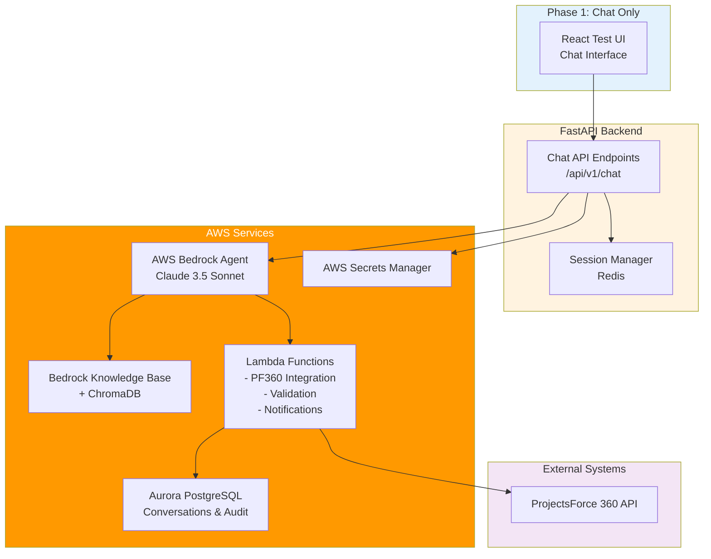

# Project Implementation Plan: AI Scheduling Agent
## Phased Rollout Strategy with Phase 1 Effort Estimation

**Version:** 1.0
**Date:** October 2025
**Status:** Planning Phase
**Project Type:** Phased Implementation (3 Phases)

---

## Executive Summary

This document outlines the implementation plan for the AI Scheduling Agent across three distinct phases, with detailed effort estimation for Phase 1. The phased approach minimizes risk, enables early value delivery, and allows for iterative learning.

### Phase Overview

| Phase | Scope | Duration | Risk Level | Business Value |
|-------|-------|----------|------------|----------------|
| **Phase 1: Chat** | Web chat interface with AWS Bedrock Agent | 8-10 weeks | LOW | 40% automation target |
| **Phase 2: SMS** | Bidirectional SMS via Twilio | 4-5 weeks | MEDIUM | 70% automation target |
| **Phase 3: Voice** | Voice calls with AWS Transcribe/Polly | 6-7 weeks | HIGH | 80%+ automation target |

**Total Timeline:** 18-22 weeks (4.5-5.5 months)

### Phase 1 Summary

**Objective:** Launch chat-based scheduling agent for customers and coordinators

**Effort Estimate:** **480-600 person-hours** (3 engineers × 4-5 weeks)

**Key Deliverables:**
- AWS Bedrock Agent with action groups configured
- Aurora PostgreSQL database with conversation tracking
- FastAPI backend with chat endpoints
- React test UI for development and pilot testing
- ChromaDB knowledge base integration
- Basic analytics dashboard

---

## Table of Contents

1. [Phase 1: Chat Application - Detailed Breakdown](#phase-1-chat-application-detailed-breakdown)
2. [Phase 2: SMS Channel - Overview](#phase-2-sms-channel-overview)
3. [Phase 3: Voice Channel - Overview](#phase-3-voice-channel-overview)
4. [Resource Requirements](#resource-requirements)
5. [Risk Management](#risk-management)
6. [Success Criteria & Milestones](#success-criteria--milestones)

---

## Phase 1: Chat Application - Detailed Breakdown

### 1.1 Phase 1 Objectives

**Primary Goal:** Deliver a production-ready chat interface that automates booking, rescheduling, cancellation, and status queries with ≥40% automation rate and >95% intent accuracy.

**Success Metrics:**
- Intent classification accuracy: >95%
- Response latency: <1s (p95)
- Chat session completion rate: >70%
- Critical write error rate: <2 per 1,000 operations
- System uptime: >99%

**Out of Scope for Phase 1:**
- SMS/Voice channels
- Coordinator bulk operations (route optimization)
- Weather-aware scheduling
- Proactive outbound notifications

---

### 1.2 Technical Architecture (Phase 1)



---

### 1.3 Work Breakdown Structure (WBS)

#### **Epic 1: AWS Infrastructure Setup**
**Total Effort:** 60-80 hours

| Task ID | Task Description | Effort (hrs) | Dependencies | Owner |
|---------|------------------|--------------|--------------|-------|
| 1.1 | AWS account setup & IAM configuration | 8 | None | DevOps |
| 1.2 | Aurora PostgreSQL Serverless v2 provisioning | 12 | 1.1 | Backend |
| 1.3 | Redis ElastiCache setup (dev & prod) | 8 | 1.1 | Backend |
| 1.4 | S3 buckets for logs, backups, assets | 4 | 1.1 | DevOps |
| 1.5 | VPC, security groups, networking | 16 | 1.1 | DevOps |
| 1.6 | AWS Secrets Manager configuration | 4 | 1.1 | DevOps |
| 1.7 | CloudWatch dashboards & alarms | 8 | 1.1 | DevOps |

**Deliverables:**
- Infrastructure as Code (Terraform/CloudFormation)
- Network architecture diagram
- Security compliance checklist

---

#### **Epic 2: AWS Bedrock Agent Configuration**
**Total Effort:** 80-100 hours

| Task ID | Task Description | Effort (hrs) | Dependencies | Owner |
|---------|------------------|--------------|--------------|-------|
| 2.1 | Bedrock Agent creation & IAM roles | 12 | 1.1 | AI/ML Engineer |
| 2.2 | Agent instruction prompt engineering | 24 | None | AI/ML Engineer |
| 2.3 | Action Group: Scheduling (book/reschedule/cancel) | 20 | 2.1 | Backend |
| 2.4 | Action Group: Query (status/technician info) | 16 | 2.1 | Backend |
| 2.5 | Lambda function: PF360 integration | 16 | 1.2 | Backend |
| 2.6 | Lambda function: Validation engine | 12 | 1.2 | Backend |

**Deliverables:**
- Bedrock Agent configured with action groups
- OpenAPI schemas for action groups
- Lambda functions deployed
- Agent testing framework

---

#### **Epic 3: Knowledge Base & ChromaDB Setup**
**Total Effort:** 40-50 hours

| Task ID | Task Description | Effort (hrs) | Dependencies | Owner |
|---------|------------------|--------------|--------------|-------|
| 3.1 | ChromaDB server deployment (Docker/ECS) | 12 | 1.1 | DevOps |
| 3.2 | Knowledge base content collection (FAQs, policies) | 16 | None | Product/BA |
| 3.3 | Document chunking & embedding pipeline | 12 | 3.1 | AI/ML Engineer |
| 3.4 | Bedrock Knowledge Base integration | 8 | 2.1, 3.3 | AI/ML Engineer |

**Deliverables:**
- ChromaDB instance with initial knowledge corpus
- Embedding pipeline scripts
- Knowledge base test queries

---

#### **Epic 4: Database Schema & Data Layer**
**Total Effort:** 50-60 hours

| Task ID | Task Description | Effort (hrs) | Dependencies | Owner |
|---------|------------------|--------------|--------------|-------|
| 4.1 | Database schema design (conversations, messages, audit) | 8 | None | Backend |
| 4.2 | SQLAlchemy models & migrations (Alembic) | 16 | 4.1, 1.2 | Backend |
| 4.3 | Repository layer (data access patterns) | 12 | 4.2 | Backend |
| 4.4 | Seed data & test fixtures | 8 | 4.2 | Backend |
| 4.5 | Database backup & recovery procedures | 6 | 1.2 | DevOps |

**Deliverables:**
- Database schema DDL scripts
- SQLAlchemy models with async support
- Migration scripts
- Backup/restore runbook

---

#### **Epic 5: FastAPI Backend Development**
**Total Effort:** 100-120 hours

| Task ID | Task Description | Effort (hrs) | Dependencies | Owner |
|---------|------------------|--------------|--------------|-------|
| 5.1 | FastAPI project structure & configuration | 8 | None | Backend |
| 5.2 | Chat API endpoints (/chat, /confirm) | 24 | 2.6, 4.3 | Backend |
| 5.3 | Session management with Redis | 16 | 1.3 | Backend |
| 5.4 | AWS Bedrock Agent invocation wrapper | 20 | 2.1 | Backend |
| 5.5 | Authentication & authorization (JWT) | 16 | None | Backend |
| 5.6 | Rate limiting & middleware | 8 | None | Backend |
| 5.7 | Error handling & logging (structlog) | 12 | None | Backend |
| 5.8 | Health check & monitoring endpoints | 4 | None | Backend |
| 5.9 | API documentation (OpenAPI/Swagger) | 4 | 5.2 | Backend |

**Deliverables:**
- FastAPI application with async endpoints
- Pydantic request/response models
- Authentication layer
- API documentation

---

#### **Epic 6: ProjectsForce 360 Integration**
**Total Effort:** 60-80 hours

| Task ID | Task Description | Effort (hrs) | Dependencies | Owner |
|---------|------------------|--------------|--------------|-------|
| 6.1 | PF360 API client with retry logic (httpx) | 20 | None | Backend |
| 6.2 | Get order details endpoint | 8 | 6.1 | Backend |
| 6.3 | Get availability/slots endpoint | 12 | 6.1 | Backend |
| 6.4 | Book appointment (idempotency) | 16 | 6.1 | Backend |
| 6.5 | Reschedule/cancel appointments | 12 | 6.1 | Backend |
| 6.6 | Circuit breaker & fallback handling | 8 | 6.1 | Backend |
| 6.7 | Integration tests with PF360 sandbox | 12 | 6.1-6.5 | Backend/QA |

**Deliverables:**
- PF360 API client library
- Integration test suite
- Error handling documentation

---

#### **Epic 7: React Test UI Development**
**Total Effort:** 60-70 hours

| Task ID | Task Description | Effort (hrs) | Dependencies | Owner |
|---------|------------------|--------------|--------------|-------|
| 7.1 | React project setup (Vite + TypeScript) | 4 | None | Frontend |
| 7.2 | Chat interface component (message list, input) | 20 | None | Frontend |
| 7.3 | WebSocket/REST integration with backend | 16 | 5.2 | Frontend |
| 7.4 | Conversation history & session management | 12 | None | Frontend |
| 7.5 | Confirmation flow UI (for critical actions) | 8 | None | Frontend |
| 7.6 | Error states & loading indicators | 6 | None | Frontend |
| 7.7 | Responsive design (mobile/desktop) | 4 | None | Frontend |

**Deliverables:**
- React chat application
- Reusable UI components
- TypeScript type definitions

---

#### **Epic 8: Testing & Quality Assurance**
**Total Effort:** 70-90 hours

| Task ID | Task Description | Effort (hrs) | Dependencies | Owner |
|---------|------------------|--------------|--------------|-------|
| 8.1 | Unit tests (backend, >80% coverage) | 32 | 5.1-5.9 | Backend |
| 8.2 | Integration tests (API + DB) | 24 | 5.1-5.9, 6.1-6.6 | Backend/QA |
| 8.3 | End-to-end tests (chat workflows) | 20 | 7.1-7.7 | QA |
| 8.4 | Bedrock Agent prompt testing (golden dataset) | 16 | 2.2, 3.4 | AI/ML Engineer |
| 8.5 | Load testing (Locust/k6) | 8 | All epics | QA |
| 8.6 | Security testing (OWASP top 10) | 12 | All epics | Security |

**Deliverables:**
- Pytest test suite (unit + integration)
- E2E test scenarios (Playwright/Cypress)
- Load test report
- Security assessment

---

#### **Epic 9: Deployment & DevOps**
**Total Effort:** 40-50 hours

| Task ID | Task Description | Effort (hrs) | Dependencies | Owner |
|---------|------------------|--------------|--------------|-------|
| 9.1 | Docker containerization (backend, frontend) | 12 | 5.1, 7.1 | DevOps |
| 9.2 | CI/CD pipeline (GitHub Actions) | 16 | 9.1 | DevOps |
| 9.3 | AWS ECS/Fargate deployment configs | 12 | 9.1 | DevOps |
| 9.4 | Staging environment setup | 8 | 9.3 | DevOps |
| 9.5 | Production deployment runbook | 4 | 9.3 | DevOps |

**Deliverables:**
- Dockerfiles & docker-compose
- CI/CD pipeline with automated tests
- Deployment scripts
- Rollback procedures

---

#### **Epic 10: Documentation & Training**
**Total Effort:** 30-40 hours

| Task ID | Task Description | Effort (hrs) | Dependencies | Owner |
|---------|------------------|--------------|--------------|-------|
| 10.1 | Developer documentation (README, setup guide) | 8 | None | Tech Lead |
| 10.2 | API documentation & examples | 8 | 5.9 | Backend |
| 10.3 | Operations runbook (monitoring, troubleshooting) | 8 | All epics | DevOps |
| 10.4 | User training materials (coordinators) | 8 | 7.1-7.7 | Product |
| 10.5 | Video demos & walkthroughs | 4 | All epics | Product |

**Deliverables:**
- Complete technical documentation
- Operations playbook
- Training videos
- Knowledge base articles

---

### 1.4 Phase 1 Effort Summary

| Epic | Effort Range (hours) | Percentage |
|------|---------------------|------------|
| Epic 1: AWS Infrastructure | 60-80 | 13% |
| Epic 2: Bedrock Agent | 80-100 | 17% |
| Epic 3: Knowledge Base | 40-50 | 8% |
| Epic 4: Database Layer | 50-60 | 10% |
| Epic 5: FastAPI Backend | 100-120 | 21% |
| Epic 6: PF360 Integration | 60-80 | 13% |
| Epic 7: React UI | 60-70 | 12% |
| Epic 8: Testing & QA | 70-90 | 15% |
| Epic 9: Deployment | 40-50 | 8% |
| Epic 10: Documentation | 30-40 | 6% |
| **TOTAL** | **480-600 hours** | **100%** |

**Team Capacity Calculation:**
- **Team Size:** 3 engineers (1 Backend, 0.5 Frontend, 0.5 DevOps, 0.5 AI/ML, 0.5 QA)
- **Working Hours:** 40 hours/week per person
- **Sprint Duration:** 2 weeks
- **Total Sprints:** 4-5 sprints

**Timeline:**
- **Optimistic:** 8 weeks (480 hours ÷ 3 people ÷ 40 hrs/week = 4 weeks, + 4 weeks buffer)
- **Realistic:** 10 weeks (600 hours ÷ 3 people ÷ 40 hrs/week = 5 weeks, + 5 weeks buffer)

**Contingency:** 20% buffer included for unknowns, PF360 API discovery, AWS learning curve

---

### 1.5 Phase 1 Sprint Breakdown

#### **Sprint 1 (Weeks 1-2): Foundation**
**Goal:** Infrastructure ready, Bedrock Agent configured

**Deliverables:**
- AWS infrastructure provisioned
- Aurora database with schema
- Bedrock Agent created with basic instructions
- ChromaDB deployed

**Key Tasks:**
- Epics 1, 2 (partial), 3 (partial), 4

---

#### **Sprint 2 (Weeks 3-4): Core Backend**
**Goal:** Working API with Bedrock integration

**Deliverables:**
- FastAPI backend with chat endpoints
- Bedrock Agent action groups configured
- PF360 integration (read operations)
- Session management

**Key Tasks:**
- Epics 2 (completion), 5, 6 (partial)

---

#### **Sprint 3 (Weeks 5-6): Full Integration**
**Goal:** Complete booking flow with UI

**Deliverables:**
- React chat interface
- End-to-end booking flow
- PF360 write operations (book/reschedule/cancel)
- Knowledge base integrated

**Key Tasks:**
- Epics 3 (completion), 6 (completion), 7

---

#### **Sprint 4 (Weeks 7-8): Testing & Hardening**
**Goal:** Production-ready system

**Deliverables:**
- Comprehensive test coverage
- Load tested and optimized
- Security hardened
- Documentation complete

**Key Tasks:**
- Epics 8, 9, 10

---

#### **Sprint 5 (Weeks 9-10): Pilot & Refinement** *(if needed)*
**Goal:** Internal pilot with refinements

**Deliverables:**
- Internal pilot with 10 users
- Bug fixes and UX improvements
- Production deployment
- Training materials

**Key Tasks:**
- Pilot testing
- Feedback incorporation
- Production launch

---

### 1.6 Phase 1 Resource Requirements

#### **Team Composition**

| Role | Allocation | Responsibilities |
|------|------------|------------------|
| **Backend Engineer** | 1.0 FTE | FastAPI, Bedrock integration, PF360 client, Lambda functions |
| **Frontend Engineer** | 0.5 FTE | React UI, chat interface, WebSocket integration |
| **DevOps Engineer** | 0.5 FTE | AWS infrastructure, CI/CD, monitoring |
| **AI/ML Engineer** | 0.5 FTE | Bedrock Agent configuration, prompt engineering, knowledge base |
| **QA Engineer** | 0.5 FTE | Test automation, E2E testing, quality assurance |
| **Product Manager** | 0.25 FTE | Requirements, acceptance criteria, stakeholder management |
| **Tech Lead/Architect** | 0.25 FTE | Technical guidance, code reviews, architecture decisions |

**Total Team:** ~3.5 FTE

#### **External Dependencies**

| Dependency | Owner | Risk | Mitigation |
|------------|-------|------|------------|
| PF360 API access (sandbox) | PF360 Team | MEDIUM | Request access in Week 0; use stubs if delayed |
| PF360 API documentation | PF360 Team | LOW | Review existing docs; schedule walkthrough |
| AWS Bedrock access | AWS Account Admin | LOW | Request access in Week 0 |
| Sample customer data | Business Operations | LOW | Synthetic data generation as backup |

---

### 1.7 Phase 1 Deliverables Checklist

#### **Technical Deliverables**
- [ ] AWS infrastructure (Aurora, Redis, Lambda, Bedrock)
- [ ] Bedrock Agent with 2 action groups configured
- [ ] ChromaDB knowledge base with initial content
- [ ] FastAPI backend with chat API
- [ ] React test UI with chat interface
- [ ] PF360 integration library
- [ ] Database schema with migrations
- [ ] Test suite (unit, integration, E2E)
- [ ] CI/CD pipeline
- [ ] Monitoring dashboards (CloudWatch)

#### **Documentation Deliverables**
- [ ] Technical architecture document (updated)
- [ ] API documentation (OpenAPI)
- [ ] Developer setup guide
- [ ] Operations runbook
- [ ] User training materials
- [ ] Test plan & results

#### **Business Deliverables**
- [ ] Pilot test plan
- [ ] Success metrics dashboard
- [ ] Risk register with mitigations
- [ ] Go/no-go decision criteria

## Appendix A: Phase 1 Detailed Schedule (Gantt)

```
Week 1-2: Foundation
├── AWS Infrastructure Setup          [████████████████████]
├── Bedrock Agent Creation           [████████████████]
├── Database Schema Design           [████████████]
└── Project Kickoff                  [████]

Week 3-4: Core Development
├── FastAPI Backend Development      [████████████████████████]
├── Action Group Configuration       [████████████████]
├── PF360 Integration (Read)         [████████████████]
└── Redis Session Management         [████████████]

Week 5-6: Integration
├── React UI Development             [████████████████████████]
├── Knowledge Base Setup             [████████████████]
├── PF360 Integration (Write)        [████████████████████]
└── E2E Integration                  [████████████████]

Week 7-8: Testing & Hardening
├── Unit & Integration Tests         [████████████████████]
├── E2E Test Automation              [████████████████]
├── Load Testing                     [████████████]
├── Security Testing                 [████████████]
└── Documentation                    [████████████████]

Week 9-10: Pilot & Launch
├── Internal Pilot                   [████████████████]
├── Bug Fixes & Refinement           [████████████████████]
├── Production Deployment            [████████]
└── Training & Handoff               [████████████]
```

---

## Appendix B: Technology Checklist

### Phase 1 Technology Stack

**Backend:**
- [x] Python 3.11+
- [x] FastAPI
- [x] UV package manager
- [x] Pydantic v2
- [x] SQLAlchemy 2.0+ (async)
- [x] Asyncpg (PostgreSQL driver)
- [x] Boto3 / Aioboto3 (AWS SDK)

**AWS Services:**
- [x] AWS Bedrock Agents
- [x] Aurora PostgreSQL Serverless v2
- [x] Lambda Functions
- [x] AWS Secrets Manager
- [x] CloudWatch
- [x] S3

**Frontend:**
- [x] React 18+
- [x] TypeScript
- [x] Vite
- [x] TailwindCSS (optional)

**Testing:**
- [x] Pytest
- [x] Playwright/Cypress
- [x] Locust (load testing)

**DevOps:**
- [x] Docker
- [x] GitHub Actions
- [x] AWS ECS Fargate
- [x] Terraform (IaC)