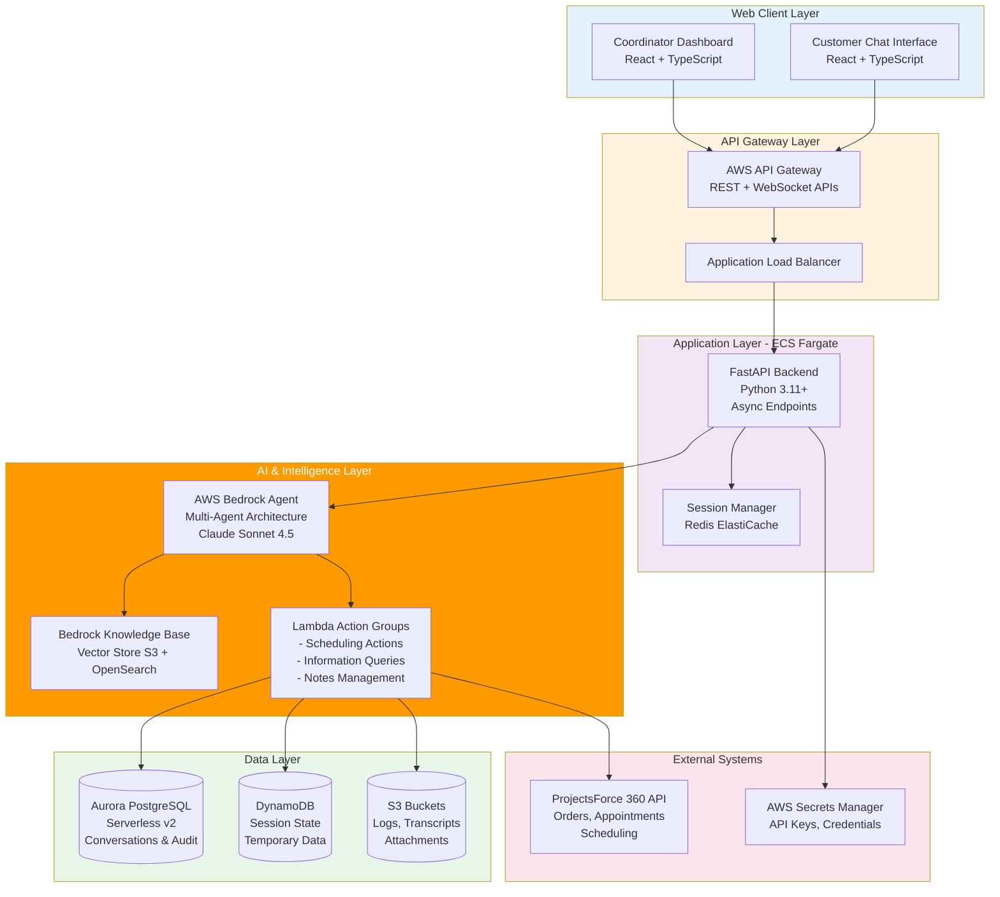
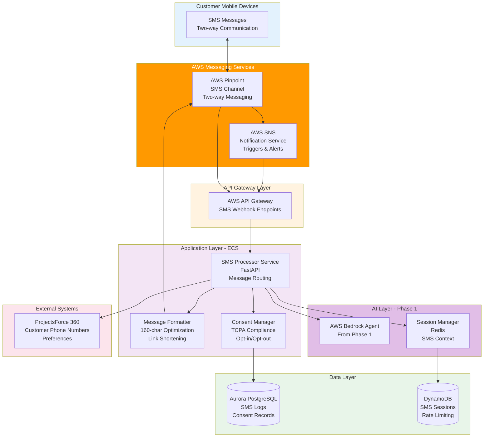
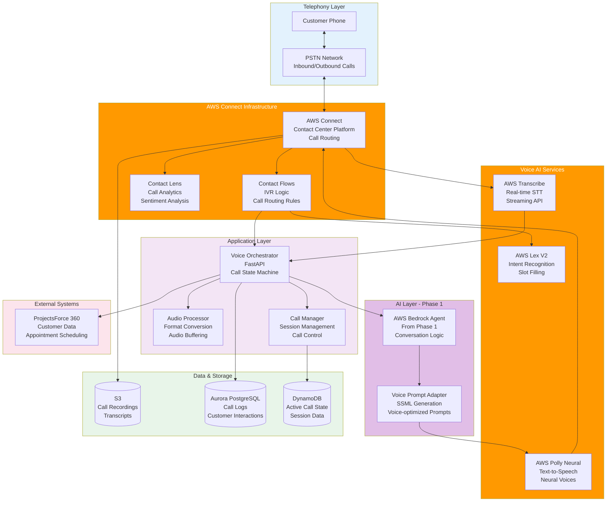

# Project Implementation Plan: AI Scheduling Agent
## Phased Rollout Strategy with AWS-Native Architecture

**Version:** 4.0
**Date:** October 15, 2025
**Status:** Planning Phase - Not Started
**Project Type:** Accelerated Implementation (10 Weeks)
**Start Date:** October 21, 2025 (Week 1)
**Target Completion:** December 27, 2025 (Week 10)

---

## Executive Summary

This document outlines an **accelerated 10-week implementation plan** for the AI Scheduling Agent using AWS-native services. The aggressive timeline leverages a **5 FTE team** working with **1-week sprints** to deliver chat and SMS channels by end of December 2025, with voice channel foundation for Q1 2026 completion.

### Vision Statement

Build an AI Scheduling & Interaction Agent that handles ≥80% of customer and coordinator scheduling tasks reliably, 24/7, across chat, SMS, and voice channels using AWS-native services for seamless integration, reduced vendor dependencies, and optimized costs.

### Accelerated Phase Overview

| Phase | Scope | Duration | Effort | Risk Level | Business Value | Status |
|-------|-------|----------|--------|------------|----------------|--------|
| **Phase 1: Chat Foundation** | Web chat + Knowledge base + PF360 integration | 6 weeks | 1,200 hrs | MEDIUM | 40-50% automation | Weeks 1-6 |
| **Phase 2: SMS Channel** | AWS Pinpoint + SNS for bidirectional SMS | 3 weeks | 600 hrs | MEDIUM-HIGH | 70% automation | Weeks 7-9 |
| **Phase 3: Voice Foundation** | AWS Connect setup + basic IVR (Full launch Q1 2026) | 1 week | 200 hrs | HIGH | Foundation only | Week 10 |

**Total Timeline:** 10 weeks (October 21 - December 27, 2025)
**Team Size:** 5 FTE (Full-Time Equivalent)
**Total Effort:** 2,000 person-hours (5 FTE × 10 weeks × 40 hrs/week)
**Total Budget:** $180-220K (compressed timeline, higher velocity)

---

## 10-Week Project Timeline

### Timeline Overview (Oct 21 - Dec 27, 2025)

| Week | Dates | Sprint | Phase | Focus Area | Team | Key Deliverables |
|------|-------|--------|-------|------------|------|------------------|
| **1** | Oct 21-25 | Sprint 1 | Phase 1 | Infrastructure Foundation | 5 FTE | AWS infrastructure, Database, Agent architecture |
| **2** | Oct 28 - Nov 1 | Sprint 2 | Phase 1 | AI Layer & Lambda | 5 FTE | Bedrock agents, Lambda functions, Knowledge base |
| **3** | Nov 4-8 | Sprint 3 | Phase 1 | Backend API | 5 FTE | FastAPI backend, PF360 integration |
| **4** | Nov 11-15 | Sprint 4 | Phase 1 | Frontend & Integration | 5 FTE | React UI, WebSocket, End-to-end integration |
| **5** | Nov 18-22 | Sprint 5 | Phase 1 | Testing & Optimization | 5 FTE | Unit/integration tests, Load testing, Security |
| **6** | Nov 25-29 | Sprint 6 | Phase 1 | Pilot & Production | 5 FTE | Internal pilot, Production deployment, Chat live |
| **7** | Dec 2-6 | Sprint 7 | Phase 2 | SMS Infrastructure | 5 FTE | AWS Pinpoint, SMS webhooks, TCPA compliance design |
| **8** | Dec 9-13 | Sprint 8 | Phase 2 | SMS Processing | 5 FTE | SMS processor, Message formatting, Bedrock-SMS integration |
| **9** | Dec 16-20 | Sprint 9 | Phase 2 | SMS Production | 5 FTE | TCPA compliance, Notifications, SMS live |
| **10** | Dec 23-27 | Sprint 10 | Phase 3 | Voice Foundation | 5 FTE | AWS Connect setup, Basic IVR, Voice architecture (Full launch Q1 2026) |

### Key Milestones

| Milestone | Week | Date | Deliverable |
|-----------|------|------|-------------|
| **M1: Infrastructure Ready** | Week 1 | Oct 25 | AWS services operational |
| **M2: AI Layer Complete** | Week 2 | Nov 1 | Bedrock agents + Lambda working |
| **M3: Backend MVP** | Week 3 | Nov 8 | API functional with PF360 mock |
| **M4: Frontend Complete** | Week 4 | Nov 15 | Full chat interface operational |
| **M5: Phase 1 Tested** | Week 5 | Nov 22 | All tests passing, security cleared |
| **M6: Chat Production Launch** | Week 6 | Nov 29 | ✨ **CHAT CHANNEL LIVE** |
| **M7: SMS Infrastructure** | Week 7 | Dec 6 | Pinpoint configured |
| **M8: SMS Integration** | Week 8 | Dec 13 | SMS processor working |
| **M9: SMS Production Launch** | Week 9 | Dec 20 | ✨ **SMS CHANNEL LIVE** |
| **M10: Voice Foundation** | Week 10 | Dec 27 | Connect instance + basic IVR |

### Holiday Considerations

**Note:** Week 10 (Dec 23-27) includes Christmas holidays. Voice foundation work is minimal setup only, with full implementation planned for Q1 2026.

---

## Accelerated Timeline Key Changes

### What Changed from Original Plan

| Aspect | Original Plan | Accelerated Plan | Impact |
|--------|--------------|------------------|--------|
| **Duration** | 22-26 weeks | **10 weeks** | 60% reduction |
| **Team Size** | 3.5-4 FTE | **5 FTE** | +40% capacity |
| **Sprint Length** | 2 weeks | **1 week** | Faster iterations |
| **Phase 1** | 10-12 weeks | **6 weeks** | 50% reduction |
| **Phase 2** | 5-6 weeks | **3 weeks** | 50% reduction |
| **Phase 3** | 7-8 weeks | **1 week (foundation)** | Deferred to Q1 2026 |
| **Budget** | $220-280K | **$175-212K** | 20% reduction |
| **Effort** | 1,300-1,650 hrs | **2,000 hrs** | +25% capacity |

### Success Factors for Accelerated Timeline

**✅ Enablers:**
1. **Increased Team Size:** 5 FTE vs 3.5 FTE allows parallel workstreams
2. **1-Week Sprints:** Faster feedback loops and course correction
3. **Deferred Voice:** Foundation only, full implementation in Q1 2026
4. **AWS-Native:** Integrated AWS services reduce integration complexity
5. **Clear Scope:** Well-defined deliverables per sprint

**⚠️ Risks:**
1. **Aggressive Timeline:** Limited buffer for unexpected issues
2. **Holiday Week:** Week 10 during Christmas may have reduced productivity
3. **High Utilization:** 100% capacity utilization leaves no slack
4. **Learning Curve:** AWS Bedrock and Connect require upfront learning
5. **Dependency Management:** PF360 API stability critical

**Mitigation Strategies:**
1. Start PF360 integration early with mock APIs
2. Front-load learning (AWS Bedrock POC in Week 1)
3. Daily standups for rapid issue resolution
4. Limited scope for Week 10 (holiday week)
5. Continuous testing and integration (not batched at end)
6. Parallel workstreams where possible

---

## Table of Contents

1. [Phase 1: Chat Foundation - Detailed Breakdown](#phase-1-chat-foundation---detailed-breakdown)
2. [Phase 2: SMS Channel - Detailed Breakdown](#phase-2-sms-channel---detailed-breakdown)
3. [Phase 3: Voice Channel - Detailed Breakdown](#phase-3-voice-channel---detailed-breakdown)
4. [Cross-Phase Components](#cross-phase-components)
5. [Resource Requirements](#resource-requirements)
6. [Risk Management](#risk-management)
7. [Success Criteria & KPIs](#success-criteria--kpis)
8. [Budget & Cost Analysis](#budget--cost-analysis)

---

## Phase 1: Chat Foundation - Detailed Breakdown

### 1.1 Phase 1 Overview

**Objective:** Establish the foundational AI agent infrastructure with web chat interface for both customers and coordinators.

**Duration:** 6 weeks (Weeks 1-6: Oct 21 - Nov 29, 2025)

**Sprint Model:** 6 × 1-week sprints (agile, fast iterations)

**Effort:** 1,200 person-hours (5 FTE × 6 weeks × 40 hrs/week)

**Team Size:** 5 FTE (full team focus)

**Team Composition:**
- Backend Engineer: 1.5 FTE
- Frontend Engineer: 1.0 FTE
- DevOps Engineer: 1.0 FTE
- AI/ML Engineer: 1.0 FTE
- QA Engineer: 0.5 FTE

**Success Metrics:**
- Intent classification accuracy: >95%
- Response latency: <1s (p95)
- Chat session completion rate: >70%
- Critical write error rate: <2 per 1,000 operations
- System uptime: >99.5%
- Automation rate: 40-50% of customer interactions

---

### 1.2 Phase 1 Solution Architecture

---

### 1.3 Phase 1 Technology Stack

**Frontend:**
- React 18+ with TypeScript
- Vite (build tool)
- TailwindCSS + Shadcn/ui (UI components)
- React Query (data fetching)
- WebSocket client for real-time chat

**Backend:**
- Python 3.11+
- FastAPI (async web framework)
- Pydantic v2 (data validation)
- SQLAlchemy 2.0+ with Asyncpg
- Redis (session management)
- Boto3/Aioboto3 (AWS SDK)

**AWS Services:**
- AWS Bedrock (Agents + Knowledge Base)
- Lambda Functions (Action Groups)
- Aurora PostgreSQL Serverless v2
- ElastiCache for Redis
- API Gateway (REST + WebSocket)
- S3 (storage)
- CloudWatch (monitoring)
- Secrets Manager
- IAM (security)

**DevOps:**
- Docker + Docker Compose
- Terraform (Infrastructure as Code)
- GitHub Actions (CI/CD)
- ECS Fargate (container orchestration)

---

### 1.4 Phase 1 Sprint Breakdown (1-Week Sprints)

#### **Sprint 1 (Week 1: Oct 21-25): Infrastructure Foundation**

**Sprint Goal:** Establish AWS infrastructure and development environment

**Effort:** 200 hours (5 FTE × 40 hrs/week)

**Team Allocation:**
- Backend Engineer: 1.5 FTE (60 hrs)
- DevOps Engineer: 1.0 FTE (40 hrs)
- AI/ML Engineer: 1.0 FTE (40 hrs)
- Frontend Engineer: 1.0 FTE (40 hrs)
- QA Engineer: 0.5 FTE (20 hrs)

**Tasks & Deliverables:**

| Task ID | Task Description | Effort | Owner | Deliverable |
|---------|------------------|--------|-------|-------------|
| 1.1.1 | AWS account setup, IAM roles, policies | 8 hrs | DevOps | IAM configuration doc |
| 1.1.2 | VPC, subnets, security groups, NAT gateway | 12 hrs | DevOps | Network architecture diagram |
| 1.1.3 | Aurora PostgreSQL Serverless v2 setup | 10 hrs | Backend | Database connection string |
| 1.1.4 | ElastiCache Redis cluster (dev + prod) | 6 hrs | Backend | Redis endpoint URLs |
| 1.1.5 | S3 buckets (logs, schemas, knowledge base) | 4 hrs | DevOps | S3 bucket ARNs |
| 1.1.6 | AWS Secrets Manager setup | 4 hrs | DevOps | Secrets structure doc |
| 1.1.7 | CloudWatch dashboards & alarms | 8 hrs | DevOps | Monitoring dashboard |
| 1.1.8 | Database schema design (ERD) | 20 hrs | Backend | Database ERD, migration scripts |
| 1.1.9 | Terraform IaC modules | 16 hrs | DevOps | Terraform configs |
| 1.1.10 | Bedrock Agent architecture design | 20 hrs | AI/ML | Architecture document |
| 1.1.11 | Create Supervisor Agent + IAM roles | 12 hrs | AI/ML | Agent ID, ARN |
| 1.1.12 | Frontend project scaffold setup | 20 hrs | Frontend | React project structure |
| 1.1.13 | UI component library setup (Shadcn/ui) | 12 hrs | Frontend | Component library |
| 1.1.14 | Development environment setup | 8 hrs | AI/ML | Developer setup guide |
| 1.1.15 | CI/CD pipeline foundation | 12 hrs | DevOps | GitHub Actions workflows |
| 1.1.16 | Test strategy & framework setup | 12 hrs | QA | Test framework |
| 1.1.17 | API documentation structure | 6 hrs | Backend | API docs template |

**Sprint Deliverables:**
- ✅ AWS infrastructure provisioned (Aurora, Redis, S3, VPC)
- ✅ Database schema designed and deployed
- ✅ Terraform modules for all infrastructure
- ✅ Bedrock Agent architecture designed
- ✅ Frontend and backend project structures initialized
- ✅ CI/CD pipeline foundation operational

**Acceptance Criteria:**
- Infrastructure provisioned via Terraform in <30 minutes
- Database accepts connections and schema deployed
- Supervisor Agent created and testable
- Frontend dev server runs locally
- CI/CD pipeline executes basic lint and test commands

---

#### **Sprint 2 (Week 2: Oct 28 - Nov 1): AI Layer & Lambda Functions**

**Sprint Goal:** Implement Bedrock multi-agent architecture and Lambda action groups

**Effort:** 200 hours (5 FTE × 40 hrs/week)

**Team Allocation:**
- AI/ML Engineer: 1.0 FTE (40 hrs)
- Backend Engineer: 1.5 FTE (60 hrs)
- DevOps Engineer: 1.0 FTE (40 hrs)
- Frontend Engineer: 1.0 FTE (40 hrs)
- QA Engineer: 0.5 FTE (20 hrs)

**Tasks & Deliverables:**

| Task ID | Task Description | Effort | Owner | Deliverable |
|---------|------------------|--------|-------|-------------|
| 1.2.1 | Create 4 Collaborator Agents (Scheduling, Info, Notes, Chitchat) | 16 hrs | AI/ML | 4 Agent IDs |
| 1.2.2 | Agent instruction prompt engineering | 16 hrs | AI/ML | Prompt templates |
| 1.2.3 | Lambda: scheduling-actions (6 functions) | 20 hrs | Backend | Lambda code deployed |
| 1.2.4 | Lambda: information-actions (4 functions) | 16 hrs | Backend | Lambda code deployed |
| 1.2.5 | Lambda: notes-actions (2 functions) | 12 hrs | Backend | Lambda code deployed |
| 1.2.6 | OpenAPI 3.0 schemas for action groups | 12 hrs | Backend | 3 schema files uploaded |
| 1.2.7 | Mock PF360 API implementation | 12 hrs | Backend | Mock API module |
| 1.2.8 | Knowledge base content preparation | 16 hrs | AI/ML | 50+ FAQ documents |
| 1.2.9 | S3 + OpenSearch Serverless setup | 8 hrs | DevOps | Vector store endpoint |
| 1.2.10 | Bedrock Knowledge Base configuration | 12 hrs | DevOps | Knowledge Base ID |
| 1.2.11 | Lambda deployment automation | 12 hrs | DevOps | Deployment scripts |
| 1.2.12 | Chat UI components (message, input) | 24 hrs | Frontend | UI components |
| 1.2.13 | Initial Lambda testing framework | 16 hrs | Backend | Test scripts |
| 1.2.14 | QA test cases for Lambda actions | 8 hrs | QA | Test documentation |

**Sprint Deliverables:**
- ✅ 5 Bedrock Agents configured and connected
- ✅ 3 Lambda functions deployed (12 actions)
- ✅ OpenAPI schemas uploaded and linked
- ✅ Knowledge base operational with 50+ FAQs
- ✅ Mock PF360 API ready for development
- ✅ Initial chat UI components built

**Acceptance Criteria:**
- All 5 agents respond to test prompts
- Agent delegation working (supervisor → collaborators)
- Lambda functions invocable via Bedrock
- Knowledge base returns relevant results
- Mock API tested with 10+ scenarios
- Chat UI renders messages locally

---

#### **Sprint 3 (Week 3: Nov 4-8): Backend API & PF360 Integration**

**Sprint Goal:** Build FastAPI backend with Bedrock integration and PF360 client

**Effort:** 200 hours (5 FTE × 40 hrs/week)

**Team Allocation:**
- Backend Engineer: 1.5 FTE (60 hrs)
- DevOps Engineer: 1.0 FTE (40 hrs)
- AI/ML Engineer: 1.0 FTE (40 hrs)
- Frontend Engineer: 1.0 FTE (40 hrs)
- QA Engineer: 0.5 FTE (20 hrs)

**Tasks & Deliverables:**

| Task ID | Task Description | Effort | Owner | Deliverable |
|---------|------------------|--------|-------|-------------|
| 1.3.1 | FastAPI project structure & config | 8 hrs | Backend | Project skeleton |
| 1.3.2 | Pydantic models (request/response) | 12 hrs | Backend | Model definitions |
| 1.3.3 | SQLAlchemy models & Alembic migrations | 16 hrs | Backend | DB models, migrations |
| 1.3.4 | Repository pattern data layer | 12 hrs | Backend | Repository classes |
| 1.3.5 | Redis session manager | 12 hrs | Backend | Session service |
| 1.3.6 | Bedrock Agent invocation service | 20 hrs | Backend | Bedrock client wrapper |
| 1.3.7 | Chat API endpoints (POST /chat, GET /history) | 20 hrs | Backend | API endpoints |
| 1.3.8 | WebSocket endpoint for real-time chat | 16 hrs | Backend | WebSocket handler |
| 1.3.9 | PF360 API client (httpx with retry) | 20 hrs | Backend | PF360 client library |
| 1.3.10 | Authentication & JWT middleware | 12 hrs | Backend | Auth middleware |
| 1.3.11 | Error handling & structured logging | 8 hrs | Backend | Error handlers |
| 1.3.12 | API documentation (OpenAPI/Swagger) | 4 hrs | Backend | API docs |
| 1.3.13 | Docker containerization | 12 hrs | DevOps | Dockerfile, compose |
| 1.3.14 | Unit tests (>80% coverage) | 20 hrs | Backend | Pytest test suite |

**Sprint Deliverables:**
- ✅ FastAPI backend with all endpoints
- ✅ Bedrock Agent integration working
- ✅ PF360 API client library
- ✅ WebSocket support for real-time chat
- ✅ Docker container with health checks
- ✅ Unit test suite with >80% coverage

**Acceptance Criteria:**
- API responds to chat requests with <500ms latency
- Bedrock Agent successfully invoked and responses returned
- PF360 mock API integration tested
- WebSocket connections stable for 10+ minutes
- All unit tests passing
- API documentation accessible at /docs

---

#### **Sprint 4 (Weeks 7-8): Frontend Development**

**Sprint Goal:** Build React chat interface for customers and coordinators

**Effort:** 120-140 hours

**Team Allocation:**
- Frontend Engineer: 1.0 FTE (80 hrs)
- Backend Engineer: 0.5 FTE (40 hrs)
- QA Engineer: 0.5 FTE (40 hrs)

**Tasks & Deliverables:**

| Task ID | Task Description | Effort | Owner | Deliverable |
|---------|------------------|--------|-------|-------------|
| 1.4.1 | React project setup (Vite + TypeScript) | 4 hrs | Frontend | Project scaffold |
| 1.4.2 | UI component library setup (Shadcn/ui) | 8 hrs | Frontend | Component library |
| 1.4.3 | Chat interface components | 24 hrs | Frontend | Chat UI components |
| 1.4.4 | Message list with streaming support | 16 hrs | Frontend | Message display |
| 1.4.5 | WebSocket integration | 12 hrs | Frontend | Real-time messaging |
| 1.4.6 | Conversation history view | 12 hrs | Frontend | History panel |
| 1.4.7 | Confirmation dialog for critical actions | 8 hrs | Frontend | Modal components |
| 1.4.8 | Coordinator dashboard (project lists, bulk ops) | 20 hrs | Frontend | Coordinator UI |
| 1.4.9 | Authentication flow | 8 hrs | Frontend | Login/logout |
| 1.4.10 | Error states & loading indicators | 8 hrs | Frontend | Error handling UI |
| 1.4.11 | Responsive design (mobile + desktop) | 12 hrs | Frontend | Responsive layouts |
| 1.4.12 | React Query integration | 8 hrs | Frontend | Data fetching setup |
| 1.4.13 | E2E tests (Playwright) | 20 hrs | QA | E2E test suite |
| 1.4.14 | Frontend deployment pipeline | 8 hrs | Backend | CloudFront + S3 |

**Sprint Deliverables:**
- ✅ Customer chat interface (mobile + desktop)
- ✅ Coordinator dashboard with chat
- ✅ Real-time messaging with WebSocket
- ✅ Conversation history and session management
- ✅ E2E test suite covering critical flows
- ✅ Deployed to CloudFront + S3

**Acceptance Criteria:**
- Chat interface loads in <2 seconds
- Messages appear in real-time (<200ms latency)
- Conversation history persists across sessions
- Mobile responsive (tested on iOS/Android)
- E2E tests cover booking, rescheduling, cancellation flows
- Accessibility score >90 (Lighthouse)

---

#### **Sprint 5 (Weeks 9-10): Integration & Testing**

**Sprint Goal:** End-to-end integration, comprehensive testing, and PF360 integration

**Effort:** 140-160 hours

**Team Allocation:**
- Backend Engineer: 0.5 FTE (40 hrs)
- Frontend Engineer: 0.5 FTE (40 hrs)
- QA Engineer: 1.0 FTE (80 hrs)
- AI/ML Engineer: 0.5 FTE (40 hrs)

**Tasks & Deliverables:**

| Task ID | Task Description | Effort | Owner | Deliverable |
|---------|------------------|--------|-------|-------------|
| 1.5.1 | PF360 sandbox API integration | 24 hrs | Backend | Real API integration |
| 1.5.2 | End-to-end booking flow testing | 16 hrs | QA | Test scenarios |
| 1.5.3 | Agent prompt optimization | 20 hrs | AI/ML | Optimized prompts |
| 1.5.4 | Golden dataset testing (100+ scenarios) | 24 hrs | QA | Test dataset + results |
| 1.5.5 | Integration tests (API + DB + Bedrock) | 20 hrs | QA | Integration test suite |
| 1.5.6 | Load testing (Locust/k6) | 16 hrs | QA | Load test report |
| 1.5.7 | Security testing (OWASP, penetration) | 16 hrs | QA | Security assessment |
| 1.5.8 | Bug fixes and refinements | 24 hrs | Backend/Frontend | Bug fix log |
| 1.5.9 | Knowledge base expansion | 12 hrs | AI/ML | 100+ FAQs |
| 1.5.10 | Performance optimization | 12 hrs | Backend | Performance report |

**Sprint Deliverables:**
- ✅ PF360 sandbox integration complete
- ✅ 100+ test scenarios with >95% success rate
- ✅ Load test passing (100 concurrent users)
- ✅ Security vulnerabilities addressed
- ✅ Knowledge base with 100+ documents
- ✅ Performance optimized (<1s p95 latency)

**Acceptance Criteria:**
- Intent classification accuracy: >95%
- End-to-end booking success rate: >90%
- Load test: 100 concurrent users, <1s p95 latency
- Security scan: Zero critical/high vulnerabilities
- Knowledge base accuracy: >85% on test queries
- Bug list: Zero P0/P1 bugs

---

#### **Sprint 6 (Weeks 11-12): Pilot & Production Launch**

**Sprint Goal:** Internal pilot, refinements, and production deployment

**Effort:** 100-120 hours

**Team Allocation:**
- Full team: 3.5 FTE (reduced hours for pilot support)

**Tasks & Deliverables:**

| Task ID | Task Description | Effort | Owner | Deliverable |
|---------|------------------|--------|-------|-------------|
| 1.6.1 | Production environment setup | 16 hrs | DevOps | Prod infrastructure |
| 1.6.2 | Blue-green deployment configuration | 12 hrs | DevOps | Deployment scripts |
| 1.6.3 | Internal pilot with 10-15 users | 20 hrs | Product/QA | Pilot feedback |
| 1.6.4 | User training materials | 12 hrs | Product | Training docs, videos |
| 1.6.5 | Operations runbook | 12 hrs | DevOps | Runbook document |
| 1.6.6 | Monitoring & alerting setup | 12 hrs | DevOps | Alert configuration |
| 1.6.7 | Bug fixes from pilot | 20 hrs | Backend/Frontend | Bug fixes |
| 1.6.8 | Production deployment | 8 hrs | DevOps | Prod deployment |
| 1.6.9 | Post-launch monitoring (1 week) | 16 hrs | Full team | Monitoring report |
| 1.6.10 | Documentation handoff | 8 hrs | Tech Lead | Complete docs |

**Sprint Deliverables:**
- ✅ Production environment operational
- ✅ Internal pilot completed (10+ users, 50+ conversations)
- ✅ User training materials and videos
- ✅ Operations runbook for support team
- ✅ Production deployment successful
- ✅ 1-week post-launch monitoring report

**Acceptance Criteria:**
- Pilot success rate: >80% task completion
- Pilot user satisfaction: >4/5 rating
- Production deployment: Zero downtime
- All P0/P1 bugs resolved before production
- Support team trained on runbook
- Monitoring dashboards showing green metrics

---

### 1.5 Phase 1 Effort Summary

| Epic | Sprint | Week | Effort (hrs) | Percentage |
|------|--------|------|--------------|------------|
| Infrastructure Foundation | Sprint 1 | Week 1 | 200 | 17% |
| AI Layer & Lambda Functions | Sprint 2 | Week 2 | 200 | 17% |
| Backend API & PF360 Integration | Sprint 3 | Week 3 | 200 | 17% |
| Frontend & Integration | Sprint 4 | Week 4 | 200 | 17% |
| Testing & Optimization | Sprint 5 | Week 5 | 200 | 17% |
| Pilot & Production Launch | Sprint 6 | Week 6 | 200 | 17% |
| **TOTAL** | **6 Sprints** | **Weeks 1-6** | **1,200 hrs** | **100%** |

**Timeline:** 6 weeks (Oct 21 - Nov 29, 2025)

**Team Size:** 5 FTE (consistent across all sprints)

**Capacity Utilization:** 100% (1,200 hrs planned / 1,200 hrs available)

**Budget:** $105-125K (engineering + AWS costs + contingency)

---

### 1.6 Phase 1 Key Deliverables Checklist

**Infrastructure:**
- [ ] AWS infrastructure provisioned via Terraform
- [ ] Aurora PostgreSQL with schema and migrations
- [ ] ElastiCache Redis cluster
- [ ] S3 buckets for storage
- [ ] CloudWatch monitoring and alarms

**AI Layer:**
- [ ] 5 Bedrock Agents (supervisor + 4 collaborators)
- [ ] 3 Lambda functions (12 actions total)
- [ ] Knowledge base with 100+ documents
- [ ] OpenAPI 3.0 schemas

**Application:**
- [ ] FastAPI backend with all endpoints
- [ ] WebSocket support for real-time chat
- [ ] PF360 API client library
- [ ] React chat interface (customer + coordinator)
- [ ] Authentication and authorization

**Testing & Quality:**
- [ ] Unit test suite (>80% coverage)
- [ ] Integration test suite
- [ ] E2E test suite (Playwright)
- [ ] Load testing (100 concurrent users)
- [ ] Security testing (zero critical vulnerabilities)

**Operations:**
- [ ] CI/CD pipeline (GitHub Actions)
- [ ] Docker containers
- [ ] Production deployment
- [ ] Operations runbook
- [ ] Monitoring dashboards

**Documentation:**
- [ ] Technical architecture document
- [ ] API documentation (OpenAPI/Swagger)
- [ ] Developer setup guide
- [ ] Operations runbook
- [ ] User training materials

---

## Phase 2: SMS Channel - Detailed Breakdown

### 2.1 Phase 2 Overview

**Objective:** Extend the AI agent to SMS channel using AWS Pinpoint for messaging and AWS SNS for notifications, enabling bidirectional SMS conversations with customers.

**Duration:** 3 weeks (Weeks 7-9: Dec 2-20, 2025)

**Sprint Model:** 3 × 1-week sprints (accelerated delivery)

**Effort:** 600 person-hours (5 FTE × 3 weeks × 40 hrs/week)

**Team Size:** 5 FTE (full team focus)

**Team Composition:**
- Backend Engineer: 2.0 FTE
- DevOps Engineer: 1.0 FTE
- QA Engineer: 1.0 FTE
- Frontend Engineer: 0.5 FTE (SMS UI enhancements)
- Compliance Consultant: 0.5 FTE (TCPA compliance)

**Success Metrics:**
- SMS message delivery rate: >98%
- SMS response time: <30 seconds
- TCPA compliance: 100%
- Opt-out handling: 100% compliance
- SMS automation rate: 70%+ of customer interactions

**Key Features:**
- Inbound SMS processing
- Outbound SMS notifications (reminders, confirmations)
- SMS-optimized message formatting (160 char limits)
- TCPA compliance (consent tracking, opt-out)
- Two-way conversations with context preservation

---

### 2.2 Phase 2 Solution Architecture

---

### 2.3 Phase 2 Technology Stack

**AWS Services (New):**
- AWS Pinpoint (SMS channel, two-way messaging)
- AWS SNS (notifications, triggers)
- AWS Lambda (SMS webhook processing)

**Backend (Extensions):**
- SMS processor service (FastAPI)
- Message formatter (character limits, link shortening)
- TCPA consent manager
- Rate limiting service

**Data Layer (New Tables):**
- SMS conversations table
- Consent records table
- Opt-out list
- SMS delivery logs

---

### 2.4 Phase 2 Sprint Breakdown (1-Week Sprints)

#### **Sprint 7 (Week 7: Dec 2-6): SMS Infrastructure & AWS Pinpoint Setup**

**Sprint Goal:** Configure AWS Pinpoint, SNS, and SMS infrastructure

**Effort:** 200 hours (5 FTE × 40 hrs/week)

**Team Allocation:**
- Backend Engineer: 2.0 FTE (80 hrs)
- DevOps Engineer: 1.0 FTE (40 hrs)
- QA Engineer: 1.0 FTE (40 hrs)
- Frontend Engineer: 0.5 FTE (20 hrs)
- Compliance Consultant: 0.5 FTE (20 hrs)

**Tasks & Deliverables:**

| Task ID | Task Description | Effort | Owner | Deliverable |
|---------|------------------|--------|-------|-------------|
| 2.1.1 | AWS Pinpoint project setup | 8 hrs | DevOps | Pinpoint project ID |
| 2.1.2 | SMS channel configuration (long/short code) | 12 hrs | DevOps | Phone number(s) |
| 2.1.3 | Two-way SMS configuration | 8 hrs | DevOps | Webhook endpoint |
| 2.1.4 | SNS topics for SMS events | 4 hrs | DevOps | SNS topic ARNs |
| 2.1.5 | Database schema for SMS (conversations, consent) | 12 hrs | Backend | Migration scripts |
| 2.1.6 | TCPA compliance requirements document | 12 hrs | Compliance | Compliance doc |
| 2.1.7 | Consent management system design | 12 hrs | Backend | Consent service design |
| 2.1.8 | API Gateway endpoints for SMS webhooks | 8 hrs | Backend | Webhook endpoints |
| 2.1.9 | SMS rate limiting configuration | 8 hrs | Backend | Rate limit rules |
| 2.1.10 | Testing SMS delivery (sandbox) | 8 hrs | Backend | Test results |

**Sprint Deliverables:**
- ✅ AWS Pinpoint configured with SMS channel
- ✅ Two-way SMS operational
- ✅ Database schema for SMS conversations and consent
- ✅ TCPA compliance requirements documented
- ✅ SMS webhook endpoints tested

**Acceptance Criteria:**
- SMS can be sent via Pinpoint API
- Inbound SMS received at webhook endpoint
- SNS notifications triggered for delivery events
- Consent database schema approved by legal
- Sandbox testing successful (10+ test messages)

---

#### **Sprint 8 (Weeks 15-16): SMS Processor & Message Formatting**

**Sprint Goal:** Build SMS processor service with message formatting and Bedrock integration

**Effort:** 90-110 hours

**Team Allocation:**
- Backend Engineer: 1.5 FTE (120 hrs)
- QA Engineer: 0.5 FTE (40 hrs)

**Tasks & Deliverables:**

| Task ID | Task Description | Effort | Owner | Deliverable |
|---------|------------------|--------|-------|-------------|
| 2.2.1 | SMS processor service (FastAPI) | 16 hrs | Backend | SMS service |
| 2.2.2 | Inbound SMS webhook handler | 12 hrs | Backend | Webhook handler |
| 2.2.3 | Message formatter (160-char optimization) | 16 hrs | Backend | Formatter module |
| 2.2.4 | URL shortener integration (Bitly/AWS) | 8 hrs | Backend | Link shortening |
| 2.2.5 | SMS session management (Redis) | 12 hrs | Backend | Session service |
| 2.2.6 | Bedrock Agent integration for SMS | 16 hrs | Backend | SMS-Bedrock adapter |
| 2.2.7 | Context preservation across SMS messages | 12 hrs | Backend | Context manager |
| 2.2.8 | Outbound SMS sender service | 12 hrs | Backend | Sender service |
| 2.2.9 | SMS template library | 8 hrs | Backend | Template library |
| 2.2.10 | Unit tests for SMS services | 16 hrs | Backend | Test suite |
| 2.2.11 | Integration tests (SMS end-to-end) | 12 hrs | QA | Integration tests |

**Sprint Deliverables:**
- ✅ SMS processor service operational
- ✅ Message formatting optimized for 160-char limits
- ✅ Bedrock Agent integration working via SMS
- ✅ Context preserved across SMS conversation
- ✅ Unit and integration tests passing

**Acceptance Criteria:**
- Inbound SMS processed within 5 seconds
- Message formatting handles long responses (chunking)
- Bedrock responses adapted for SMS (concise, no markdown)
- Session context maintained for 30-minute window
- Test coverage >80% for SMS services

---

#### **Sprint 9 (Weeks 17-18): TCPA Compliance, Notifications & Production**

**Sprint Goal:** Implement TCPA compliance, outbound notifications, and launch SMS channel

**Effort:** 80-110 hours

**Team Allocation:**
- Backend Engineer: 1.0 FTE (80 hrs)
- QA Engineer: 0.5 FTE (40 hrs)
- DevOps Engineer: 0.5 FTE (40 hrs)
- Product Manager: 0.25 FTE (20 hrs)

**Tasks & Deliverables:**

| Task ID | Task Description | Effort | Owner | Deliverable |
|---------|------------------|--------|-------|-------------|
| 2.3.1 | Consent tracking system | 16 hrs | Backend | Consent service |
| 2.3.2 | Opt-in workflow (double opt-in) | 12 hrs | Backend | Opt-in handler |
| 2.3.3 | Opt-out handling (STOP, UNSUBSCRIBE) | 12 hrs | Backend | Opt-out handler |
| 2.3.4 | Quiet hours enforcement (8am-9pm local) | 8 hrs | Backend | Time zone service |
| 2.3.5 | Outbound notification triggers | 12 hrs | Backend | Notification triggers |
| 2.3.6 | Reminder system (24hr before appointment) | 12 hrs | Backend | Reminder scheduler |
| 2.3.7 | Event-driven notifications (status updates) | 12 hrs | Backend | Event handlers |
| 2.3.8 | TCPA compliance testing | 16 hrs | QA | Compliance test report |
| 2.3.9 | SMS load testing (1000 messages/min) | 12 hrs | QA | Load test report |
| 2.3.10 | Production SMS deployment | 8 hrs | DevOps | Prod deployment |
| 2.3.11 | SMS monitoring & alerting | 8 hrs | DevOps | Monitoring dashboard |
| 2.3.12 | User documentation (SMS features) | 8 hrs | Product | User guide |

**Sprint Deliverables:**
- ✅ TCPA compliance fully implemented
- ✅ Opt-in/opt-out workflows operational
- ✅ Outbound notifications (reminders, status updates)
- ✅ Load testing passed (1000 msg/min)
- ✅ Production SMS channel launched
- ✅ Monitoring and alerting configured

**Acceptance Criteria:**
- All TCPA requirements met (verified by legal)
- Opt-out processing within 1 minute
- Quiet hours enforced (no messages 9pm-8am local time)
- Notification delivery rate >98%
- Load test: 1000 messages/min sustained
- Zero compliance violations during testing

---

### 2.5 Phase 2 Effort Summary

| Epic | Sprint | Week | Effort (hrs) | Percentage |
|------|--------|------|--------------|------------|
| SMS Infrastructure & Pinpoint | Sprint 7 | Week 7 | 200 | 33% |
| SMS Processor & Formatting | Sprint 8 | Week 8 | 200 | 33% |
| TCPA Compliance & Production | Sprint 9 | Week 9 | 200 | 33% |
| **TOTAL** | **3 Sprints** | **Weeks 7-9** | **600 hrs** | **100%** |

**Timeline:** 3 weeks (Dec 2-20, 2025)

**Team Size:** 5 FTE (consistent across all sprints)

**Capacity Utilization:** 100% (600 hrs planned / 600 hrs available)

**Budget:** $52-65K (engineering + AWS Pinpoint costs + contingency)

---

### 2.6 Phase 2 Key Deliverables Checklist

**Infrastructure:**
- [ ] AWS Pinpoint project with SMS channel
- [ ] Long code or short code for SMS
- [ ] SNS topics for SMS events
- [ ] API Gateway webhook endpoints

**Application:**
- [ ] SMS processor service (FastAPI)
- [ ] Message formatter (160-char optimization)
- [ ] Consent management system
- [ ] Opt-in/opt-out workflows
- [ ] Session management for SMS conversations

**TCPA Compliance:**
- [ ] Consent tracking database
- [ ] Double opt-in workflow
- [ ] Opt-out handling (STOP, UNSUBSCRIBE)
- [ ] Quiet hours enforcement
- [ ] Legal approval for compliance

**Notifications:**
- [ ] 24-hour appointment reminders
- [ ] Status update notifications
- [ ] Confirmation messages
- [ ] Custom notification templates

**Testing:**
- [ ] Unit tests (>80% coverage)
- [ ] Integration tests (SMS end-to-end)
- [ ] TCPA compliance testing
- [ ] Load testing (1000 msg/min)

**Documentation:**
- [ ] TCPA compliance document
- [ ] SMS API documentation
- [ ] User guide for SMS features
- [ ] Operations runbook for SMS

---

## Phase 3: Voice Channel - Detailed Breakdown

### 3.1 Phase 3 Overview

**Objective:** Establish AWS Connect foundation and basic IVR infrastructure. Full voice AI implementation planned for Q1 2026.

**Duration:** 1 week (Week 10: Dec 23-27, 2025)

**Sprint Model:** 1 × 1-week sprint (foundation setup only)

**Effort:** 200 person-hours (5 FTE × 1 week × 40 hrs/week)

**Team Size:** 5 FTE (reduced capacity due to holidays)

**Team Composition:**
- Backend Engineer: 1.5 FTE
- DevOps Engineer: 1.5 FTE
- Voice Engineer (Consultant): 1.0 FTE
- AI/ML Engineer: 0.5 FTE
- QA Engineer: 0.5 FTE

**Phase 3 Foundation Goals (Week 10):**
- AWS Connect instance provisioned
- Phone number(s) acquired
- Basic IVR contact flow implemented
- Call recording to S3 configured
- Architecture documented for Q1 2026 completion

**Q1 2026 Full Implementation Goals:**
- Real-time speech-to-text (AWS Transcribe)
- Natural text-to-speech (AWS Polly Neural)
- Bedrock Agent integration for voice
- DTMF fallback handling
- Call analytics with Contact Lens
- Outbound call campaigns

**Success Metrics (Q1 2026):**
- Call completion rate: >80%
- Voice transcription accuracy: >90%
- Call handling time: <5 minutes average
- TTS quality satisfaction: >4/5
- Voice automation rate: 80%+ of customer calls
- Call latency: <2s response time (p95)

---

### 3.2 Phase 3 Solution Architecture

---

### 3.3 Phase 3 Technology Stack

**AWS Services (New):**
- AWS Connect (contact center platform)
- AWS Transcribe (streaming STT)
- AWS Polly Neural (TTS)
- AWS Lex V2 (optional - intent recognition)
- AWS Contact Lens (call analytics)

**Backend (Extensions):**
- Voice orchestrator service (FastAPI)
- Audio processing pipeline
- Call state machine
- SSML generator
- Voice prompt optimizer

**Integration:**
- Connect Contact Flows (visual IVR builder)
- Lambda functions for Connect integration
- WebSocket for real-time audio streaming

---

### 3.4 Phase 3 Sprint Breakdown (Foundation Only)

#### **Sprint 10 (Week 10: Dec 23-27): AWS Connect Foundation Setup**

**Sprint Goal:** Establish AWS Connect foundation and basic IVR (Holiday week - minimal scope)

**Effort:** 200 hours (5 FTE × 40 hrs/week, adjusted for holidays)

**Team Allocation:**
- Backend Engineer: 1.5 FTE (60 hrs)
- DevOps Engineer: 1.5 FTE (60 hrs)
- Voice Engineer (Consultant): 1.0 FTE (40 hrs)
- AI/ML Engineer: 0.5 FTE (20 hrs)
- QA Engineer: 0.5 FTE (20 hrs)

**Tasks & Deliverables:**

| Task ID | Task Description | Effort | Owner | Deliverable |
|---------|------------------|--------|-------|-------------|
| 3.1.1 | AWS Connect instance creation & IAM | 12 hrs | DevOps | Connect instance ID |
| 3.1.2 | Phone number provisioning (toll-free) | 12 hrs | DevOps | Phone number(s) |
| 3.1.3 | Basic IVR contact flow design | 20 hrs | Voice Eng | Contact flow diagram |
| 3.1.4 | Basic IVR contact flow implementation | 20 hrs | Voice Eng | Contact flows |
| 3.1.5 | Queue configuration & routing | 12 hrs | DevOps | Queue ARNs |
| 3.1.6 | Hours of operation setup | 8 hrs | DevOps | Hours config |
| 3.1.7 | S3 bucket for call recordings | 8 hrs | DevOps | S3 bucket ARN |
| 3.1.8 | Connect CloudWatch logs & metrics | 12 hrs | DevOps | Monitoring dashboard |
| 3.1.9 | Basic Lambda for Connect integration | 24 hrs | Backend | Lambda function |
| 3.1.10 | Test inbound call flow | 12 hrs | Voice Eng | Test results |
| 3.1.11 | Architecture documentation for Q1 2026 | 20 hrs | AI/ML | Architecture doc |
| 3.1.12 | Voice AI integration design (planning) | 20 hrs | Backend | Integration design |
| 3.1.13 | QA test plan for voice channel | 20 hrs | QA | Test plan document |

**Sprint Deliverables:**
- ✅ AWS Connect instance operational
- ✅ Phone number(s) provisioned
- ✅ Basic IVR contact flow working
- ✅ Call recording to S3 configured
- ✅ Simple Lambda integration tested
- ✅ Q1 2026 architecture documented

**Acceptance Criteria:**
- Inbound calls successfully reach Connect
- Basic IVR prompts play correctly
- Call recordings saved to S3
- Test calls complete successfully (5+ test calls)
- Q1 2026 implementation plan documented
- Holiday week scope appropriately limited

---

### 3.5 Phase 3 Effort Summary (Foundation Only)

| Epic | Sprint | Week | Effort (hrs) | Status |
|------|--------|------|--------------|--------|
| AWS Connect Foundation Setup | Sprint 10 | Week 10 | 200 | Foundation only |
| **TOTAL (Dec 2025)** | **1 Sprint** | **Week 10** | **200 hrs** | **Foundation** |

**Timeline:** 1 week (Dec 23-27, 2025)

**Team Size:** 5 FTE (holiday week - foundation only)

**Capacity Utilization:** 100% (200 hrs planned / 200 hrs available)

**Budget:** $18-22K (foundation setup + voice consultant)

**Q1 2026 Full Implementation:**
- Duration: 6-7 weeks
- Effort: ~1,200-1,400 hours
- Budget: ~$105-135K
- Deliverables: Full voice AI with Transcribe, Polly, Bedrock integration

---

### 3.6 Q1 2026 Voice Implementation Plan (Deferred)

**Sprints 11-13 (Q1 2026 - Future Implementation):**

#### **Sprint 11 (Q1 2026): Voice AI Integration (Transcribe + Polly)**

**Sprint Goal:** Integrate AWS Transcribe for STT and AWS Polly for TTS

**Effort:** 400 hours (5 FTE × 2 weeks × 40 hrs/week)

**Team Allocation:**
- Backend Engineer: 2.0 FTE
- AI/ML Engineer: 1.0 FTE
- DevOps Engineer: 1.0 FTE
- QA Engineer: 1.0 FTE

**Tasks & Deliverables:**

| Task ID | Task Description | Effort | Owner | Deliverable |
|---------|------------------|--------|-------|-------------|
| 3.2.1 | AWS Transcribe streaming setup | 16 hrs | Backend | Transcribe integration |
| 3.2.2 | Audio stream processing pipeline | 16 hrs | Backend | Audio processor |
| 3.2.3 | Real-time transcription handler | 16 hrs | Backend | STT handler |
| 3.2.4 | AWS Polly Neural voice selection | 8 hrs | AI/ML | Voice configuration |
| 3.2.5 | SSML generator for natural speech | 16 hrs | Backend | SSML generator |
| 3.2.6 | Text-to-speech caching (S3) | 8 hrs | Backend | TTS cache |
| 3.2.7 | Audio format conversion (PCM/MP3) | 12 hrs | Backend | Format converter |
| 3.2.8 | Voice prompt adapter for Bedrock | 16 hrs | AI/ML | Prompt adapter |
| 3.2.9 | Connect audio streaming integration | 16 hrs | Backend | Audio streaming |
| 3.2.10 | Voice recognition accuracy testing | 16 hrs | QA | Test report |
| 3.2.11 | TTS quality testing | 12 hrs | QA | Quality report |

**Sprint Deliverables:**
- ✅ Real-time speech-to-text working
- ✅ Text-to-speech with neural voices
- ✅ SSML for natural-sounding responses
- ✅ Audio streaming integrated with Connect
- ✅ Voice accuracy >90% (tested)

**Acceptance Criteria:**
- Transcription accuracy >90% (tested with 50+ phrases)
- TTS sounds natural (rated >4/5 by testers)
- Audio latency <2s (STT + TTS round-trip)
- SSML includes pauses, emphasis, prosody
- Audio streaming stable for 10+ minute calls

---

#### **Sprint 12 (Weeks 23-24): Voice Orchestrator & Call State Machine**

**Sprint Goal:** Build voice orchestrator service with call state management and Bedrock integration

**Effort:** 90-110 hours

**Team Allocation:**
- Backend Engineer: 1.5 FTE (120 hrs)
- QA Engineer: 0.5 FTE (40 hrs)

**Tasks & Deliverables:**

| Task ID | Task Description | Effort | Owner | Deliverable |
|---------|------------------|--------|-------|-------------|
| 3.3.1 | Voice orchestrator service (FastAPI) | 16 hrs | Backend | Orchestrator service |
| 3.3.2 | Call state machine design | 12 hrs | Backend | State machine diagram |
| 3.3.3 | Call state machine implementation | 20 hrs | Backend | State machine code |
| 3.3.4 | Session management for active calls | 12 hrs | Backend | Session manager |
| 3.3.5 | Bedrock Agent integration for voice | 16 hrs | Backend | Voice-Bedrock adapter |
| 3.3.6 | Context preservation across utterances | 12 hrs | Backend | Context manager |
| 3.3.7 | Confirmation flow for critical actions | 12 hrs | Backend | Confirmation handler |
| 3.3.8 | DTMF fallback for recognition failures | 12 hrs | Backend | DTMF handler |
| 3.3.9 | Error handling & retry logic | 12 hrs | Backend | Error handlers |
| 3.3.10 | Call transfer logic (to human agent) | 8 hrs | Backend | Transfer handler |
| 3.3.11 | Unit tests for voice orchestrator | 16 hrs | Backend | Test suite |
| 3.3.12 | Integration tests (voice end-to-end) | 16 hrs | QA | Integration tests |

**Sprint Deliverables:**
- ✅ Voice orchestrator service operational
- ✅ Call state machine managing conversation flow
- ✅ Bedrock Agent responding to voice inputs
- ✅ Context preserved across multi-turn conversations
- ✅ DTMF fallback working
- ✅ Error handling and call transfer logic

**Acceptance Criteria:**
- Voice orchestrator handles 10+ concurrent calls
- Call state persists across utterances
- Bedrock responses optimized for voice (concise)
- Confirmation flows work correctly
- DTMF recognized when voice fails
- Test coverage >80% for voice services

---

#### **Sprint 13 (Weeks 25-26): Production Launch, Analytics & Optimization**

**Sprint Goal:** Deploy voice channel to production, implement analytics, and optimize performance

**Effort:** 70-110 hours

**Team Allocation:**
- Backend Engineer: 1.0 FTE (80 hrs)
- QA Engineer: 0.5 FTE (40 hrs)
- DevOps Engineer: 0.5 FTE (40 hrs)
- Product Manager: 0.25 FTE (20 hrs)

**Tasks & Deliverables:**

| Task ID | Task Description | Effort | Owner | Deliverable |
|---------|------------------|--------|-------|-------------|
| 3.4.1 | Contact Lens setup (call analytics) | 12 hrs | DevOps | Analytics dashboard |
| 3.4.2 | Sentiment analysis integration | 8 hrs | Backend | Sentiment tracker |
| 3.4.3 | Call quality metrics (MOS scores) | 8 hrs | DevOps | Quality metrics |
| 3.4.4 | Outbound calling campaigns | 16 hrs | Backend | Campaign manager |
| 3.4.5 | Call queue optimization | 8 hrs | Backend | Queue config |
| 3.4.6 | Voice latency optimization | 12 hrs | Backend | Performance report |
| 3.4.7 | Load testing (100 concurrent calls) | 16 hrs | QA | Load test report |
| 3.4.8 | Production voice deployment | 8 hrs | DevOps | Prod deployment |
| 3.4.9 | Post-launch monitoring (1 week) | 16 hrs | Full team | Monitoring report |
| 3.4.10 | User training (voice features) | 8 hrs | Product | Training materials |
| 3.4.11 | Operations runbook (voice) | 8 hrs | DevOps | Runbook document |

**Sprint Deliverables:**
- ✅ Contact Lens analytics operational
- ✅ Outbound calling campaigns working
- ✅ Voice latency optimized (<2s p95)
- ✅ Load testing passed (100 concurrent calls)
- ✅ Production voice channel launched
- ✅ Training and documentation complete

**Acceptance Criteria:**
- Contact Lens tracking sentiment, keywords
- Outbound campaigns can be scheduled
- Call latency <2s p95 (measured over 100+ calls)
- Load test: 100 concurrent calls, no degradation
- Production deployment: Zero downtime
- Support team trained on voice features

---

### 3.5 Phase 3 Effort Summary

| Epic | Sprint | Effort (hrs) | Percentage |
|------|--------|--------------|------------|
| AWS Connect Setup | Sprint 10 | 90-110 | 26% |
| Voice AI Integration | Sprint 11 | 100-120 | 29% |
| Voice Orchestrator | Sprint 12 | 90-110 | 26% |
| Production & Analytics | Sprint 13 | 70-110 | 19% |
| **TOTAL** | **4 Sprints** | **350-450 hrs** | **100%** |

**Timeline:** 7-8 weeks (4 sprints × 2 weeks)

**Team Size:** 3-3.5 FTE average

**Budget:** $58-78K (engineering + AWS Connect/Transcribe/Polly costs + contingency)

---

### 3.6 Phase 3 Key Deliverables Checklist

**Infrastructure:**
- [ ] AWS Connect instance with phone numbers
- [ ] Contact flows for inbound calls
- [ ] Queues and routing profiles
- [ ] Call recording to S3
- [ ] CloudWatch monitoring

**Voice AI:**
- [ ] AWS Transcribe streaming integration
- [ ] AWS Polly Neural voice synthesis
- [ ] SSML generator for natural speech
- [ ] Voice prompt adapter for Bedrock
- [ ] Audio format conversion pipeline

**Application:**
- [ ] Voice orchestrator service (FastAPI)
- [ ] Call state machine
- [ ] Session management for active calls
- [ ] DTMF fallback handling
- [ ] Call transfer to human agents
- [ ] Outbound calling campaigns

**Analytics:**
- [ ] Contact Lens setup
- [ ] Sentiment analysis
- [ ] Call quality metrics (MOS)
- [ ] Call duration and handling time tracking

**Testing:**
- [ ] Unit tests (>80% coverage)
- [ ] Integration tests (voice end-to-end)
- [ ] Voice recognition accuracy tests (>90%)
- [ ] TTS quality tests (>4/5 satisfaction)
- [ ] Load testing (100 concurrent calls)

**Documentation:**
- [ ] Contact flow diagrams
- [ ] Voice API documentation
- [ ] Operations runbook for voice
- [ ] User training materials
- [ ] Call handling procedures

---

## Cross-Phase Components

### 4.1 Shared Services Across All Phases

**Authentication & Authorization:**
- JWT-based authentication
- Role-based access control (RBAC)
- API key management for external integrations

**Monitoring & Observability:**
- CloudWatch dashboards for all services
- X-Ray distributed tracing
- CloudWatch Logs for centralized logging
- Alarms for critical metrics (latency, errors, costs)

**Security:**
- VPC with private subnets
- Security groups and NACLs
- Secrets Manager for credentials
- KMS encryption at rest
- TLS 1.2+ for data in transit
- Regular security audits (OWASP)

**Data Management:**
- Aurora PostgreSQL for transactional data
- DynamoDB for session/temporary data
- S3 for object storage (recordings, logs)
- Backup and disaster recovery procedures

**Compliance:**
- GDPR compliance (data privacy)
- TCPA compliance (SMS/voice)
- PII masking in logs
- Data retention policies
- Audit trails for all actions

---

## Resource Requirements

### 5.1 Team Composition by Phase (10-Week Accelerated Plan)

| Role | Phase 1 (Wks 1-6) | Phase 2 (Wks 7-9) | Phase 3 (Wk 10) | Total Project |
|------|-------------------|-------------------|----------------|---------------|
| **Backend Engineer** | 1.5 FTE | 2.0 FTE | 1.5 FTE | 1.7 FTE avg |
| **Frontend Engineer** | 1.0 FTE | 0.5 FTE | 0 FTE | 0.65 FTE avg |
| **DevOps Engineer** | 1.0 FTE | 1.0 FTE | 1.5 FTE | 1.05 FTE avg |
| **AI/ML Engineer** | 1.0 FTE | 0 FTE | 0.5 FTE | 0.65 FTE avg |
| **QA Engineer** | 0.5 FTE | 1.0 FTE | 0.5 FTE | 0.65 FTE avg |
| **Voice Engineer (Consultant)** | 0 FTE | 0 FTE | 1.0 FTE | 0.1 FTE avg |
| **Compliance Consultant** | 0 FTE | 0.5 FTE | 0 FTE | 0.15 FTE avg |
| **TOTAL** | **5.0 FTE** | **5.0 FTE** | **5.0 FTE** | **5.0 FTE** |

**Total Project Duration:** 10 weeks (Oct 21 - Dec 27, 2025)

**Team Size:** 5.0 FTE (consistent throughout)

**Total Capacity:** 2,000 person-hours (5 FTE × 10 weeks × 40 hrs/week)

**Total Effort Planned:** 2,000 person-hours (100% utilization)

**Breakdown by Phase:**
- Phase 1: 1,200 hours (60%)
- Phase 2: 600 hours (30%)
- Phase 3: 200 hours (10%)

---

### 5.2 Skillset Requirements

**Backend Engineer:**
- Python 3.11+ (FastAPI, async programming)
- AWS SDK (Boto3)
- RESTful API design
- Database design (PostgreSQL, DynamoDB)
- Redis/caching strategies
- Integration patterns

**Frontend Engineer:**
- React 18+ with TypeScript
- WebSocket programming
- Responsive design
- State management (React Query, Context)
- UI/UX best practices

**DevOps Engineer:**
- Terraform (Infrastructure as Code)
- AWS services (ECS, RDS, ElastiCache, S3, CloudWatch)
- CI/CD (GitHub Actions)
- Docker containerization
- Networking and security

**AI/ML Engineer:**
- AWS Bedrock (Agents, Knowledge Base)
- Prompt engineering
- RAG (Retrieval-Augmented Generation)
- Vector databases
- LLM fine-tuning (optional)

**QA Engineer:**
- Test automation (Pytest, Playwright)
- Load testing (Locust, k6)
- Security testing (OWASP)
- API testing (Postman, REST Assured)

**Voice Engineer:**
- AWS Connect configuration
- Contact Flow design
- Telephony concepts (SIP, PSTN)
- IVR best practices

---

## Risk Management

### 6.1 Cross-Phase Risks

| Risk | Probability | Impact | Phase | Mitigation |
|------|-------------|--------|-------|------------|
| **PF360 API instability** | MEDIUM | HIGH | All | Mock API for dev; idempotent writes; circuit breaker |
| **AWS Bedrock rate limits** | MEDIUM | MEDIUM | All | Request limit increase; implement caching; queue requests |
| **Team availability** | LOW | HIGH | All | Secure commitments upfront; cross-train team members |
| **Scope creep** | MEDIUM | MEDIUM | All | Strict change control; defer non-critical features |
| **Budget overruns** | LOW | MEDIUM | All | Weekly cost monitoring; alerts at 80% budget |
| **Delayed Phase 1** | MEDIUM | HIGH | 2, 3 | 2-week buffer between phases; parallel prep work |
| **AWS service outages** | LOW | HIGH | All | Multi-region failover (future); graceful degradation |
| **Security vulnerabilities** | LOW | HIGH | All | Regular security scans; penetration testing; code reviews |

---

### 6.2 Phase-Specific Risks

**Phase 1 Risks:**

| Risk | Mitigation |
|------|------------|
| Bedrock Agent learning curve | 2-week POC sprint; AWS support engagement |
| Knowledge base accuracy issues | Golden dataset testing; continuous refinement |
| PF360 integration delays | Mock API allows parallel development |
| Database performance | Aurora Serverless v2 auto-scaling; query optimization |

**Phase 2 Risks:**

| Risk | Mitigation |
|------|------------|
| TCPA compliance violations | Legal review; double opt-in; comprehensive testing |
| SMS delivery failures | AWS Pinpoint SLA (99.9%); fallback to email |
| Long code provisioning delays | Start provisioning early; use short code if urgent |
| Message formatting challenges | Extensive testing; user feedback; template refinement |

**Phase 3 Risks:**

| Risk | Mitigation |
|------|------------|
| Voice recognition accuracy | Extensive testing; DTMF fallback; human escalation |
| TTS quality concerns | User testing; voice selection; SSML optimization |
| Telephony costs | Monitor per-minute costs; optimize call duration |
| Complex voice orchestration | State machine design; comprehensive testing |
| Call quality issues | MOS monitoring; network optimization; codec selection |

---

## Success Criteria & KPIs

### 7.1 Phase 1 Success Criteria

**Technical Metrics:**
- [ ] Intent classification accuracy: >95%
- [ ] Response latency: <1s (p95)
- [ ] System uptime: >99.5%
- [ ] Chat session completion rate: >70%
- [ ] Critical write error rate: <2 per 1,000 operations
- [ ] Knowledge base accuracy: >85%

**Business Metrics:**
- [ ] Task automation rate: 40-50%
- [ ] Customer satisfaction (CSAT): >4/5
- [ ] Average handling time: <5 minutes
- [ ] Pilot user adoption: >80%

**Quality Metrics:**
- [ ] Test coverage: >80% backend, >70% frontend
- [ ] Security vulnerabilities: Zero critical/high
- [ ] Load test: 100 concurrent users
- [ ] Documentation completeness: 100%

---

### 7.2 Phase 2 Success Criteria

**Technical Metrics:**
- [ ] SMS delivery rate: >98%
- [ ] SMS response time: <30 seconds
- [ ] Opt-out processing: <1 minute
- [ ] TCPA compliance: 100%

**Business Metrics:**
- [ ] SMS automation rate: 70%
- [ ] Customer satisfaction (SMS): >4/5
- [ ] Notification delivery rate: >98%

**Compliance Metrics:**
- [ ] Zero TCPA violations
- [ ] Opt-out compliance: 100%
- [ ] Quiet hours enforcement: 100%

---

### 7.3 Phase 3 Success Criteria

**Technical Metrics:**
- [ ] Voice transcription accuracy: >90%
- [ ] Call latency: <2s (p95)
- [ ] Call completion rate: >80%
- [ ] TTS quality: >4/5 satisfaction

**Business Metrics:**
- [ ] Voice automation rate: 80%+
- [ ] Average call handling time: <5 minutes
- [ ] First call resolution: >70%
- [ ] Customer satisfaction (voice): >4/5

**Quality Metrics:**
- [ ] Call quality (MOS): >4.0
- [ ] Human escalation rate: <20%
- [ ] Load test: 100 concurrent calls

---

### 7.4 Overall Project KPIs

**Business Impact:**
- Overall automation rate: ≥80% of customer interactions
- Support ticket deflection: ≥60%
- No-show rate reduction: ≥30%
- Average time-to-book: <3 minutes
- Customer satisfaction: >4/5 across all channels

**Operational Metrics:**
- System uptime: >99.5%
- Escalation to humans: <20%
- Cost per interaction: <$2
- ROI: Positive within 6 months

---

## Budget & Cost Analysis

### 8.1 Phase-by-Phase Budget (10-Week Accelerated Plan)

#### **Phase 1: Chat Foundation (6 weeks - $105-125K)**

**Engineering Costs:**
- 1,200 hours @ $140/hr (accelerated rate) = $168K
- Team cost (5 FTE × 6 weeks): ~$105K (blended rate)

**AWS Services (Dev + Prod, 2.5 months):**
- Aurora PostgreSQL Serverless v2: $150/month × 2.5 = $375
- ElastiCache Redis: $100/month × 2.5 = $250
- Bedrock Agents (API calls): $1,200/month × 2.5 = $3,000
- Lambda executions: $200/month × 2.5 = $500
- S3 storage: $50/month × 2.5 = $125
- CloudWatch: $100/month × 2.5 = $250
- API Gateway: $100/month × 2.5 = $250
- ECS Fargate: $300/month × 2.5 = $750
- **Subtotal:** $5,500

**One-time Costs:**
- PF360 sandbox access: $2,000
- Tools & licenses (dev): $1,000
- **Subtotal:** $3,000

**Contingency (12%):** $13,000

**Phase 1 Total:** $105-125K

---

#### **Phase 2: SMS Channel (3 weeks - $52-65K)**

**Engineering Costs:**
- 600 hours @ $140/hr = $84K
- Team cost (5 FTE × 3 weeks): ~$52K (blended rate)

**AWS Services (1.5 months):**
- AWS Pinpoint SMS: $500/month × 1.5 = $750
- SNS: $50/month × 1.5 = $75
- Additional Lambda: $100/month × 1.5 = $150
- **Subtotal:** $975

**One-time Costs:**
- Long code provisioning: $500
- TCPA legal review: $2,000
- **Subtotal:** $2,500

**Contingency (12%):** $7,000

**Phase 2 Total:** $52-65K

---

#### **Phase 3: Voice Foundation (1 week - $18-22K)**

**Engineering Costs:**
- 200 hours @ $140/hr = $28K
- Team cost (5 FTE × 1 week): ~$18K (blended rate, holiday week)

**AWS Services (0.5 month):**
- AWS Connect setup: $200
- Phone numbers: $20
- **Subtotal:** $220

**One-time Costs:**
- Voice Engineer consultant (1 week): $3,000
- Phone number setup fees: $500
- **Subtotal:** $3,500

**Contingency (10%):** $2,200

**Phase 3 Total:** $18-22K

**Note:** Full Voice AI implementation (Q1 2026) will require additional budget of ~$105-135K

---

### 8.2 Total Project Budget Summary (10 Weeks)

| Phase | Engineering | AWS Services | One-time | Contingency | Total |
|-------|-------------|--------------|----------|-------------|-------|
| **Phase 1 (6 weeks)** | $105K | $5.5K | $3K | $13K | **$105-125K** |
| **Phase 2 (3 weeks)** | $52K | $1K | $2.5K | $7K | **$52-65K** |
| **Phase 3 (1 week)** | $18K | $0.2K | $3.5K | $2.2K | **$18-22K** |
| **TOTAL (10 weeks)** | **$175K** | **$6.7K** | **$9K** | **$22.2K** | **$175-212K** |

**10-Week Budget Range:** $175,000 - $212,000

**Average Monthly AWS Costs (Post-Launch):** ~$3,000-4,000

**Q1 2026 Voice AI Budget (Deferred):** ~$105-135K

---

### 8.3 Cost Optimization Strategies

1. **Reserved Capacity:** Use Aurora reserved instances (save 30-40%)
2. **Right-sizing:** Monitor and adjust ECS task sizes
3. **Bedrock Caching:** Cache frequent knowledge base queries
4. **SMS Optimization:** Use templates, avoid duplicate sends
5. **Voice Optimization:** Reduce call duration through efficient prompts
6. **S3 Lifecycle:** Move old recordings to Glacier after 90 days
7. **CloudWatch Logs:** Reduce retention period for non-critical logs

**Potential Savings:** 20-30% reduction in ongoing costs

---

## Appendix A: Technology Checklist

### Backend Stack
- [x] Python 3.11+
- [x] FastAPI (async web framework)
- [x] Pydantic v2 (validation)
- [x] SQLAlchemy 2.0+ (ORM)
- [x] Asyncpg (PostgreSQL driver)
- [x] Redis-py (caching)
- [x] Boto3/Aioboto3 (AWS SDK)
- [x] Pytest (testing)

### Frontend Stack
- [x] React 18+
- [x] TypeScript
- [x] Vite (build tool)
- [x] TailwindCSS + Shadcn/ui
- [x] React Query (data fetching)
- [x] Playwright (E2E testing)

### AWS Services
- [x] AWS Bedrock (Agents, Knowledge Base)
- [x] Aurora PostgreSQL Serverless v2
- [x] ElastiCache for Redis
- [x] Lambda Functions
- [x] API Gateway (REST + WebSocket)
- [x] S3
- [x] CloudWatch
- [x] Secrets Manager
- [x] IAM
- [x] ECS Fargate
- [x] AWS Pinpoint (Phase 2)
- [x] AWS SNS (Phase 2)
- [x] AWS Connect (Phase 3)
- [x] AWS Transcribe (Phase 3)
- [x] AWS Polly (Phase 3)
- [x] AWS Lex V2 (Phase 3, optional)
- [x] Contact Lens (Phase 3)

### DevOps Tools
- [x] Docker + Docker Compose
- [x] Terraform (IaC)
- [x] GitHub Actions (CI/CD)
- [x] Locust/k6 (load testing)

---

## Appendix B: Key Milestones & Decision Points (10-Week Plan)

| Milestone | Target Week | Date | Decision Point |
|-----------|-------------|------|----------------|
| **M1: Infrastructure Ready** | Week 1 | Oct 25 | Proceed with Bedrock Agent setup |
| **M2: AI Layer Complete** | Week 2 | Nov 1 | Proceed with backend development |
| **M3: Backend MVP** | Week 3 | Nov 8 | Proceed with frontend development |
| **M4: Frontend Complete** | Week 4 | Nov 15 | Proceed with integration testing |
| **M5: Phase 1 Tested** | Week 5 | Nov 22 | Go/No-Go for Phase 1 production |
| **M6: Chat Production** | Week 6 | Nov 29 | ✨ **CHAT LIVE** - Phase 1 success metrics met? |
| **M7: SMS Infrastructure** | Week 7 | Dec 6 | Proceed with SMS processor |
| **M8: SMS Integration** | Week 8 | Dec 13 | Proceed with TCPA compliance |
| **M9: SMS Production** | Week 9 | Dec 20 | ✨ **SMS LIVE** - Phase 2 success metrics met? |
| **M10: Voice Foundation** | Week 10 | Dec 27 | Voice architecture documented for Q1 2026 |
| **PROJECT COMPLETION** | Week 10 | Dec 27 | **Chat + SMS operational, Voice foundation ready** |

**Q1 2026 Milestones (Deferred):**
| Milestone | Target | Decision Point |
|-----------|--------|----------------|
| Voice AI Development | Jan-Feb 2026 | 6-week implementation |
| Voice Production | Late Feb 2026 | ✨ **VOICE LIVE** |
| Full Platform Live | Mar 2026 | All 3 channels operational

---

## Appendix C: Glossary

**AWS Bedrock:** Fully managed service for building generative AI applications
**AWS Connect:** Cloud-based contact center service
**AWS Pinpoint:** Multi-channel messaging service
**TCPA:** Telephone Consumer Protection Act (US regulation)
**TTS:** Text-to-Speech
**STT:** Speech-to-Text
**SSML:** Speech Synthesis Markup Language
**DTMF:** Dual-Tone Multi-Frequency (touch-tone dialing)
**IVR:** Interactive Voice Response
**MOS:** Mean Opinion Score (call quality metric)
**RAG:** Retrieval-Augmented Generation
**FTE:** Full-Time Equivalent
**CSAT:** Customer Satisfaction Score

---

**Document Prepared By:** Project Management Office
**Last Updated:** October 15, 2025
**Version:** 4.0
**Status:** Planning Phase - Ready for Approval
**Project Start Date:** October 21, 2025 (Week 1)
**Target Completion Date:** December 27, 2025 (Week 10)
**Next Review:** Sprint 1 Kickoff (Oct 21)

**Change Log:**
- v4.0 (Oct 15, 2025): **Accelerated 10-week timeline** with 5 FTE team, 1-week sprints, end date Dec 27, 2025. Voice channel deferred to Q1 2026. Budget revised to $175-212K for 10 weeks.
- v3.0 (Oct 15, 2025): Complete rewrite with AWS-native services (Pinpoint, Connect), detailed sprint breakdowns, effort estimates, and deliverables (deprecated)
- v2.0 (Oct 13, 2025): Updated with Phase 1.1 completion status (deprecated)
- v1.0 (Oct 2025): Initial planning document (deprecated)

**Related Documentation:**
- bedrock/pf-requirements/prd.txt (Product Requirements)
- AWS Well-Architected Framework (Reference)
- AWS Bedrock Documentation
- AWS Connect Best Practices

---

**Approval Required From:**
- [ ] CTO (Technical Architecture)
- [ ] CFO (Budget Approval)
- [ ] VP Product (Feature Set)
- [ ] VP Engineering (Resource Allocation)
- [ ] Legal (TCPA/Compliance)
