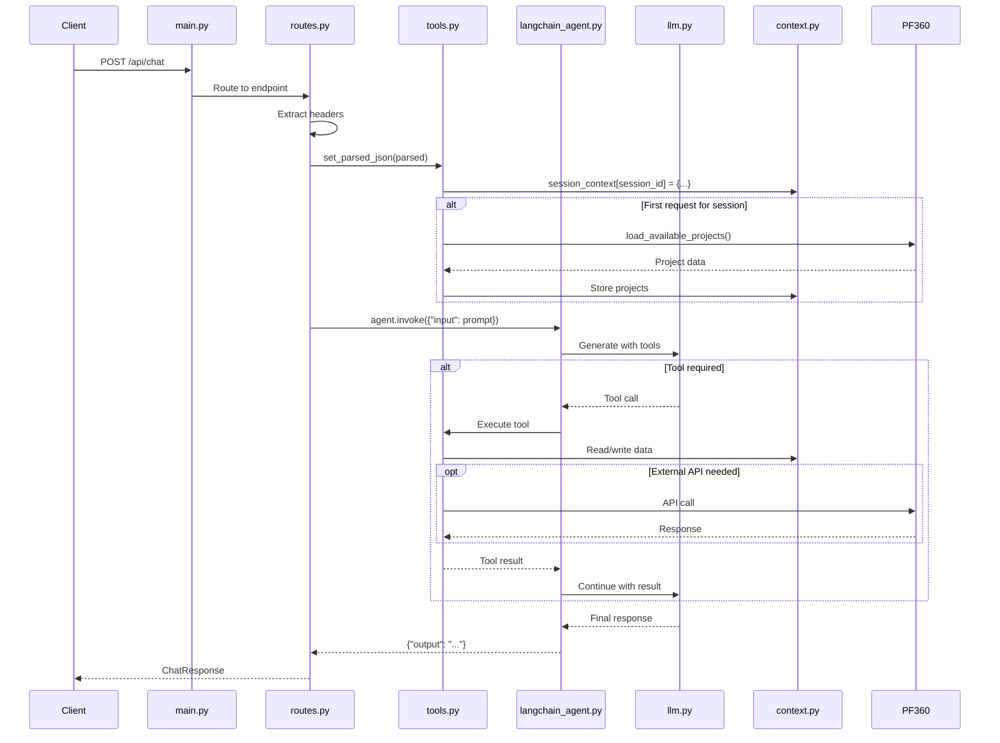

# Technical Flow Documentation - Current System

**Source**: Code analysis from actual implementation
**Files Analyzed**: main.py, api/routes.py, core/*, models/*, streamlit_chat_ui.py, Dockerfile, bitbucket-pipelines.yml

---

## System Architecture

### Components (from code)

```mermaid
graph TB
    subgraph "Client"
        Streamlit[Streamlit UI<br/>streamlit_chat_ui.py]
    end

    subgraph "FastAPI Application"
        Main[main.py<br/>FastAPI app + CORS]
        Routes[api/routes.py<br/>/api/healthz<br/>/api/chat]
    end

    subgraph "Agent"
        LangChainAgent[core/langchain_agent.py<br/>AgentExecutor]
        Memory[core/memory.py<br/>ConversationBufferMemory]
    end

    subgraph "LLM"
        LLM[core/llm.py<br/>ChatOpenAI<br/>model: gpt-4.1<br/>temperature: 0]
        RateLimiter[InMemoryRateLimiter<br/>RPS: 0.8]
    end

    subgraph "Tools"
        Tools[core/tools.py<br/>14 StructuredTools]
        Context[core/context.py<br/>session_context = {}]
    end

    subgraph "External"
        PF360[PF360 API<br/>requests.get/post]
        WeatherAPI[WeatherAPI.com<br/>requests.get]
    end

    Streamlit -->|POST /api/chat| Main
    Main --> Routes
    Routes --> LangChainAgent
    LangChainAgent --> Memory
    LangChainAgent --> LLM
    LLM --> RateLimiter
    LangChainAgent --> Tools
    Tools --> Context
    Tools --> PF360
    Tools --> WeatherAPI
```

---

## File Structure

From codebase:
```
.
├── main.py                     # FastAPI app, CORS middleware
├── api/
│   └── routes.py              # /api/healthz, /api/chat endpoints
├── core/
│   ├── context.py             # session_context = {}
│   ├── langchain_agent.py     # AgentExecutor with 14 tools
│   ├── llm.py                 # ChatOpenAI(model="gpt-4.1")
│   ├── memory.py              # ConversationBufferMemory
│   └── tools.py               # 14 tools + PF360 integration
├── models/
│   └── schemas.py             # ChatRequest, ChatResponse
├── streamlit_chat_ui.py       # Streamlit UI
├── requirements.txt           # Dependencies
├── Dockerfile                 # Python 3.13.5 container
├── bitbucket-pipelines.yml    # CI/CD to AWS EKS
└── log_conf.yaml              # Logging configuration
```

---

## Request Flow

From `api/routes.py`, lines 16-38:

```python
@router.post("/chat", response_model=ChatResponse)
async def chat(request_data: ChatRequest, request: Request):
    try:
        # 1. Extract headers
        authorization = request.headers.get("authorization")
        client_id = request.headers.get("client_id")

        # 2. Parse request
        parsed = request_data.dict()
        parsed["authorization"] = authorization
        parsed["client_id"] = client_id

        # 3. Initialize session
        set_parsed_json(parsed)

        # 4. Create prompt
        prompt_with_session = (
            f"My session ID is {parsed['session_id']}. "
            f"Customer ID is {parsed['customer_id']}. "
            f"Message: {parsed['message']}"
        )

        # 5. Invoke agent
        result = agent.invoke({"input": prompt_with_session})

        # 6. Return response
        return ChatResponse(response=result["output"])
    except Exception as e:
        logger.error(str(e), stack_info=True)
```

### Sequence Diagram (Code-based)



---

## LLM Configuration

From `core/llm.py`, lines 5-21:

```python
RPS = 0.8
CHECK_EVERY = 0.1
BURST = 5

rate_limiter = InMemoryRateLimiter(
    requests_per_second=RPS,
    check_every_n_seconds=CHECK_EVERY,
    max_bucket_size=BURST,
)

llm = ChatOpenAI(
    model="gpt-4.1",
    temperature=0,
    rate_limiter=rate_limiter,
    max_retries=3,
    timeout=60,
)
```

---

## Agent Configuration

From `core/langchain_agent.py`, lines 192-195:

```python
function_agent = create_openai_functions_agent(llm=llm, tools=tools, prompt=prompt)
agent = AgentExecutor(agent=function_agent, tools=tools, memory=memory, verbose=True)
```

**Settings:**
- `verbose=True` (line 194)
- Uses 14 tools (lines 34-115)
- Uses ConversationBufferMemory (imported from memory.py)

---

## Tools

From `core/langchain_agent.py`, 14 tools registered (lines 34-115):

1. **ListProjects** (lines 35-40)
2. **SwitchProject** (lines 41-46)
3. **ShowProjectDetails** (lines 47-52)
4. **GetWorkingDays** (lines 53-58)
5. **GetAvailableDates** (lines 59-64)
6. **GetSlotsForDate** (lines 65-70)
7. **UpdateDate** (lines 71-76)
8. **ConfirmAppointment** (lines 77-82)
9. **ShowSessionState** (lines 83-88)
10. **CancelSchedule** (lines 89-94)
11. **LoadAvailableProjects** (lines 95-100)
12. **GetCurrentWeather** (lines 101-107)
13. **AddProjectNote** (lines 109-114)

---

## Session Context

From `core/context.py`, line 1:
```python
session_context = {}  # Tracks session-wise selections
```

From `core/tools.py`, `set_parsed_json()` function initializes (lines 89-103):

```python
if (session_id not in session_context) or (
    session_id in session_context and session_id != session_context[session_id].get("session_id")
):
    session_context[session_id] = {"session_id": session_id}

session_context[session_id].update({
    "customer_id":  customer_id,
    "client_id": client_id,
    "client_name": client_name,
})

if "projects" not in session_context[session_id]:
    load_available_projects(customer_id, session_id)
```

### Session Context Structure (from code)

Fields added by different functions in `core/tools.py`:

```python
session_context[session_id] = {
    "session_id": str,           # set_parsed_json(), line 92
    "customer_id": int | str,    # set_parsed_json(), line 96
    "client_id": str,            # set_parsed_json(), line 97
    "client_name": str,          # set_parsed_json(), line 98
    "projects": list[dict],      # load_available_projects(), line 168
    "project_id": int,           # switch_project_by_text(), line 247
    "working_days": list[str],   # get_working_days(), line 354
    "available_dates": list[str], # get_available_dates(), line 369
    "request_id": str,           # get_available_dates(), line 370
    "date": str,                 # get_slots_for_date(), line 381
    "slots": list[str],          # get_slots_for_date(), line 395
    "time": str,                 # confirm_schedule(), line 450
    "notes": dict,               # add_project_note(), line 519
}
```

---

## PF360 API Integration

From `core/tools.py`, URLs constructed in `set_parsed_json()` (lines 63-66):

```python
CUSTOMER_API_URL = f"{CUSTOMER_SCHEDULER_BASE_API_URL}/dashboard/get/{client_id}"
SCHEDULER_BASE_URL = f"{CUSTOMER_SCHEDULER_BASE_API_URL}/scheduler/client/{client_id}"
BASE_PROJECT_URL = f"https://{client_name}.cx-portal.{env_url}.projectsforce.com/details"
CUSTOMER_NOTE_URL = f"{CUSTOMER_SCHEDULER_BASE_API_URL}/project-notes/add/{client_id}"
```

Environment mapping (lines 48-58):
```python
if ENVIRONMENT_NAME == "dev":
    env_url = "dev"
elif ENVIRONMENT_NAME == "qa":
    env_url = "qa"
elif ENVIRONMENT_NAME == "staging":
    env_url = "staging"
elif ENVIRONMENT_NAME == "prod":
    env_url = "apps"
else:
    env_url = "dev"
```

### API Calls (from tools.py)

| Function | Method | Endpoint |
|----------|--------|----------|
| `load_available_projects()` | GET | `{CUSTOMER_API_URL}/{customer_id}` (line 156) |
| `get_working_days()` | GET | `{SCHEDULER_BASE_URL}/business-hours` (line 351) |
| `get_available_dates()` | GET | `{SCHEDULER_BASE_URL}/project/{proj_id}/date/{today}/selected/{today}/get-rescheduler-slots` (line 361) |
| `get_slots_for_date()` | GET | `{SCHEDULER_BASE_URL}/project/{proj_id}/date/{date}/selected/{date}/get-rescheduler-slots?request_id={req_id}` (lines 387-390) |
| `confirm_schedule()` | POST | `{SCHEDULER_BASE_URL}/project/{proj_id}/schedule` (line 439) |
| `cancel_schedule()` | GET | `{SCHEDULER_BASE_URL}/project/{proj_id}/cancel-reschedule` (line 406) |
| `add_project_note()` | POST | `{CUSTOMER_NOTE_URL}/{proj_id}` (line 511) |

---

## Weather API

From `core/tools.py`, `get_current_weather()` function (lines 467-474):

```python
api_key = os.getenv("WEATHER_API_KEY", "02ffdcc1ea97431aa4c111400251408")
url = f"https://api.weatherapi.com/v1/current.json?key={api_key}&q={city}"
response = requests.get(url)
```

---

## CORS Configuration

From `main.py`, lines 14-21:

```python
app.add_middleware(
    CORSMiddleware,
    allow_origins=["*"],  # Change to specific domains in prod
    allow_credentials=True,
    allow_methods=["*"],
    allow_headers=["*"],
)
```

---

## Logging Configuration

From `main.py`, lines 6-9:

```python
logging.getLogger("uvicorn.access").setLevel(logging.ERROR)
logging.getLogger("httpcore.http11").setLevel(logging.ERROR)
logging.getLogger("urllib3.connectionpool").setLevel(logging.ERROR)
logging.getLogger("httpx").setLevel(logging.ERROR)
```

From `log_conf.yaml`, lines 20-29:

```yaml
loggers:
  uvicorn.error:
    level: INFO
    handlers:
      - default
    propagate: no
  uvicorn.access:
    level: DEBUG
    handlers:
      - access
    propagate: no
```

---

## Deployment

### Docker Configuration

From `Dockerfile`:

```dockerfile
FROM python:3.13.5
WORKDIR /app
COPY . .
RUN pip install --no-cache-dir -r requirements.txt
EXPOSE 8000
CMD ["uvicorn", "main:app", "--host", "0.0.0.0", "--port", "8000", "--reload", "--log-config=log_conf.yaml"]
```

### CI/CD Pipeline

From `bitbucket-pipelines.yml`, the pipeline:

1. Builds Docker image (line 24): `docker build -t pf-scheduler-agent-{env} .`
2. Tags image (line 25): `docker tag ... {BUILD_NUMBER}`
3. Pushes to ECR (line 26): `docker push`
4. Updates EKS deployment (lines 35-37):
   - Scales to 0 replicas
   - Scales to 1 replica with new image

**Environments:**
- `release/dev` → deployment namespace
- `release/qa` → projectforce-qa namespace
- `release/staging` → staging namespace
- `release/prod` → production (manual trigger)

**AWS EKS Clusters:**
- Dev/Staging: `projectforce-dev-eks`
- QA: `projectforce-qa-eks`
- Prod: `projectforce-production-cluster`

---

## Streamlit UI

From `streamlit_chat_ui.py`, lines 1-57:

**Configuration:**
- API URL: `http://localhost:8000/api/chat` (line 8)
- Session ID: `uuid.uuid4()` (line 21)
- Customer ID: `1645975` (line 15)
- Client ID: `09PF05VD` (line 18)
- Client name: `projectsforce-validation` (line 13)

**Request structure** (lines 33-42):
```python
payload = {
    "message":     user_input,
    "session_id":  st.session_state.session_id,
    "customer_id": customer_id,
    "client_name": client_name,
}

headers = {
    "authorization": access_token,
    "client_id": client_id,
}
```

---

## Dependencies

From `requirements.txt`:

```
fastapi
uvicorn
langchain
langchain-community
openai
pydantic
tiktoken
mangum
requests
pytz
python-dotenv
```

---

## Environment Variables

From `core/tools.py`, lines 20-23:

```python
CUSTOMER_SCHEDULER_BASE_API_URL = os.getenv("CUSTOMER_SCHEDULER_API_URL")
ENVIRONMENT_NAME = os.getenv("ENVIRONMENT")
CONFIRM_SCHEDULE_FLAG = int(os.getenv("CONFIRM_SCHEDULE_FLAG"))
CANCEL_SCHEDULE_FLAG = int(os.getenv("CANCEL_SCHEDULE_FLAG"))
```

From `core/tools.py`, line 467:
```python
api_key = os.getenv("WEATHER_API_KEY", "02ffdcc1ea97431aa4c111400251408")
```

---

## Error Handling

From `api/routes.py`, lines 37-38:

```python
except Exception as e:
    logger.error(str(e), stack_info=True)
```

**Note:** No response returned on exception (function ends without return statement).

---

## Health Check

From `api/routes.py`, lines 11-13:

```python
@router.get("/healthz")
async def health_check():
    return {"status": "ok"}
```

---

## Data Models

From `models/schemas.py`:

```python
class ChatRequest(BaseModel):
    session_id: int | str
    message: str
    customer_id: int | str
    client_name: str

class ChatResponse(BaseModel):
    response: str
```

---

## System Prompt

From `core/langchain_agent.py`, lines 119-175, the system prompt instructs the agent on scheduling operations. Key instructions include:
- Greet user first
- List projects if no project selected
- Use tools for scheduling operations
- Always confirm before booking
- Display times in AM/PM format
- Never expose session_id or project_id to users
- Show first 3 consecutive dates for scheduling
- Reload projects after schedule/reschedule/cancel
- Offer to add notes after operations

---

## Authentication Headers

From `core/tools.py`, `set_parsed_json()` (lines 68-73):

```python
AUTH_HEADER = {
    "authorization": authorization,
    "client_id":     client_id,
    "Content-Type": "application/json",
    "charset": "utf-8",
}
```

---

## Conclusion

This documentation is based solely on code analysis. All information is traceable to specific files and line numbers in the codebase.

**Files Analyzed:**
- main.py
- api/routes.py
- core/langchain_agent.py
- core/llm.py
- core/memory.py
- core/tools.py
- core/context.py
- models/schemas.py
- streamlit_chat_ui.py
- requirements.txt
- Dockerfile
- bitbucket-pipelines.yml
- log_conf.yaml
