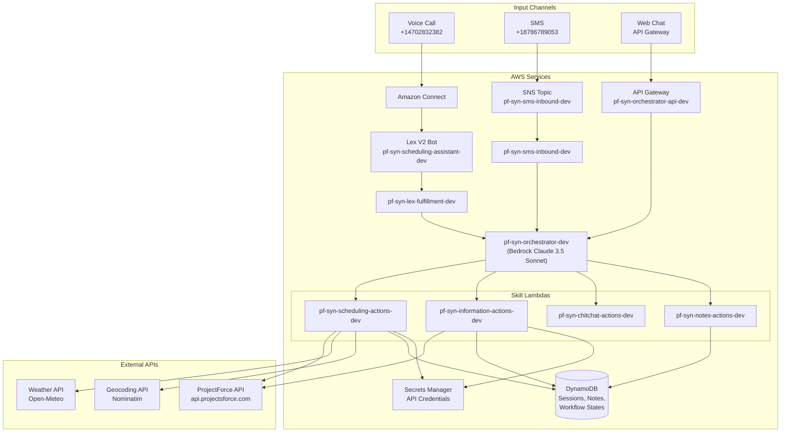
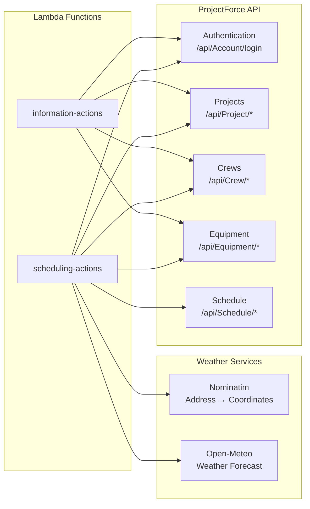
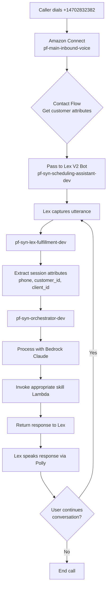
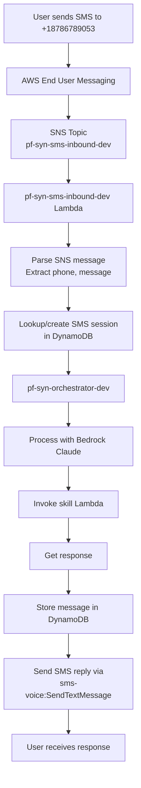

# AWS Resources Inventory - pf-syn-* Stack (Dev)

> Complete inventory of AWS resources for the `pf-syn-*` Scheduling Agent stack.

## AWS Account Details

| Item | Value |
|------|-------|
| **Account ID** | `772634497954` |
| **Region** | `us-east-1` |
| **Resource Prefix** | `pf-syn-` |

---

## 1. Lambda Functions

| Function Name | Runtime | Timeout | Memory | Role |
|---------------|---------|---------|--------|------|
| `pf-syn-orchestrator-dev` | Python 3.11 | 120s | 512 MB | `pf-syn-orchestrator-role-dev` |
| `pf-syn-scheduling-actions-dev` | Python 3.11 | 60s | 1769 MB | `pf-syn-scheduling-actions-role-dev` |
| `pf-syn-information-actions-dev` | Python 3.11 | 60s | 1769 MB | `pf-syn-information-actions-role-dev` |
| `pf-syn-chitchat-actions-dev` | Python 3.11 | 60s | 1769 MB | `pf-syn-chitchat-actions-role-dev` |
| `pf-syn-notes-actions-dev` | Python 3.11 | 60s | 512 MB | `pf-syn-notes-actions-role-dev` |
| `pf-syn-customer-lookup-dev` | Python 3.11 | 30s | 256 MB | `pf-syn-customer-lookup-role-dev` |
| `pf-syn-lex-fulfillment-dev` | Python 3.11 | 60s | 512 MB | `pf-syn-lex-fulfillment-role-dev` |
| `pf-syn-voice-bedrock-bridge-dev` | Python 3.11 | 120s | 512 MB | `pf-syn-voice-bedrock-bridge-role-dev` |
| `pf-syn-sms-inbound-dev` | Python 3.11 | 60s | 512 MB | `pf-syn-sms-inbound-role-dev` |

### Lambda Environment Variables

#### pf-syn-orchestrator-dev
```bash
ORCHESTRATOR_MODEL=us.anthropic.claude-3-5-sonnet-20241022-v2:0
SCHEDULING_LAMBDA=pf-syn-scheduling-actions-dev
INFORMATION_LAMBDA=pf-syn-information-actions-dev
CHITCHAT_LAMBDA=pf-syn-chitchat-actions-dev
NOTES_LAMBDA=pf-syn-notes-actions-dev
DYNAMODB_TABLE=pf-syn-sessions-dev
WORKFLOW_STATE_TABLE=pf-syn-workflow-states-dev
REGION=us-east-1
ALLOW_DIRECT_LAMBDA=true
USE_SUPERVISOR=false
ENABLE_MULTI_AGENT_ORCHESTRATION=false
```

#### pf-syn-scheduling-actions-dev
```bash
ENVIRONMENT=dev
USE_MOCK_API=false
DEFAULT_CLIENT_ID=09PF05VD
DYNAMODB_TABLE=pf-syn-sessions-dev
SECRET_NAME=projectforce/api/credentials
REGION=us-east-1
```

#### pf-syn-lex-fulfillment-dev
```bash
ENVIRONMENT=dev
ORCHESTRATOR_LAMBDA=pf-syn-orchestrator-dev
DYNAMODB_TABLE=pf-syn-sessions-dev
REGION=us-east-1
```

#### pf-syn-sms-inbound-dev
```bash
ORCHESTRATOR_LAMBDA=pf-syn-orchestrator-dev
SESSIONS_TABLE=pf-syn-sms-sessions-dev
SMS_SESSIONS_TABLE=pf-syn-sms-sessions-dev
MESSAGES_TABLE=pf-syn-sms-messages-dev
CONSENT_TABLE=pf-syn-sms-consent-dev
OPT_OUT_TRACKING_TABLE=pf-syn-opt-out-tracking-dev
ORIGINATION_NUMBER=+18786789053
PF_SECRET_NAME=projectforce/api/credentials
AWS_REGION_NAME=us-east-1
ENVIRONMENT=dev
REGION=us-east-1
```

---

## 2. IAM Roles

| Role Name | ARN |
|-----------|-----|
| `pf-syn-orchestrator-role-dev` | `arn:aws:iam::772634497954:role/pf-syn-orchestrator-role-dev` |
| `pf-syn-scheduling-actions-role-dev` | `arn:aws:iam::772634497954:role/pf-syn-scheduling-actions-role-dev` |
| `pf-syn-information-actions-role-dev` | `arn:aws:iam::772634497954:role/pf-syn-information-actions-role-dev` |
| `pf-syn-chitchat-actions-role-dev` | `arn:aws:iam::772634497954:role/pf-syn-chitchat-actions-role-dev` |
| `pf-syn-notes-actions-role-dev` | `arn:aws:iam::772634497954:role/pf-syn-notes-actions-role-dev` |
| `pf-syn-customer-lookup-role-dev` | `arn:aws:iam::772634497954:role/pf-syn-customer-lookup-role-dev` |
| `pf-syn-lex-fulfillment-role-dev` | `arn:aws:iam::772634497954:role/pf-syn-lex-fulfillment-role-dev` |
| `pf-syn-voice-bedrock-bridge-role-dev` | `arn:aws:iam::772634497954:role/pf-syn-voice-bedrock-bridge-role-dev` |
| `pf-syn-sms-inbound-role-dev` | `arn:aws:iam::772634497954:role/pf-syn-sms-inbound-role-dev` |
| `pf-syn-sms-twoway-role-dev` | `arn:aws:iam::772634497954:role/pf-syn-sms-twoway-role-dev` |
| `pf-syn-lex-bot-role-dev` | `arn:aws:iam::772634497954:role/pf-syn-lex-bot-role-dev` |

### Required IAM Permissions (per Lambda role)

```json
{
  "Bedrock": [
    "bedrock:InvokeModel",
    "bedrock:InvokeModelWithResponseStream"
  ],
  "Lambda": [
    "lambda:InvokeFunction"
  ],
  "DynamoDB": [
    "dynamodb:GetItem",
    "dynamodb:PutItem",
    "dynamodb:UpdateItem",
    "dynamodb:Query",
    "dynamodb:Scan",
    "dynamodb:DeleteItem"
  ],
  "SecretsManager": [
    "secretsmanager:GetSecretValue",
    "secretsmanager:PutSecretValue"
  ],
  "CloudWatchLogs": [
    "logs:CreateLogGroup",
    "logs:CreateLogStream",
    "logs:PutLogEvents"
  ],
  "SNS": [
    "sns:Publish"
  ],
  "SMSVoice": [
    "sms-voice:SendTextMessage"
  ]
}
```

---

## 3. DynamoDB Tables

| Table Name | Purpose |
|------------|---------|
| `pf-syn-sessions-dev` | User session state storage |
| `pf-syn-customers-dev` | Customer data lookup |
| `pf-syn-notes-dev` | Notes/conversation history |
| `pf-syn-project-notes-dev` | Project-specific notes |
| `pf-syn-workflow-states-dev` | Workflow state machine |
| `pf-syn-sms-sessions-dev` | SMS session tracking |
| `pf-syn-sms-messages-dev` | SMS message storage |
| `pf-syn-sms-consent-dev` | SMS consent tracking |
| `pf-syn-opt-out-tracking-dev` | SMS opt-out tracking |

---

## 4. Secrets Manager

| Secret Name | Purpose |
|-------------|---------|
| `projectforce/api/credentials` | ProjectForce API credentials (phone-based auth) |
| `pf-api-bearer-token` | API bearer token (legacy) |

---

## 5. API Gateway

| API Name | API ID | Stage | Endpoint |
|----------|--------|-------|----------|
| `pf-syn-orchestrator-api-dev` | `4e4680oc2h` | `dev` | `https://4e4680oc2h.execute-api.us-east-1.amazonaws.com/dev` |

---

## 6. Amazon Lex V2

| Item | Value |
|------|-------|
| **Bot Name** | `pf-syn-scheduling-assistant-dev` |
| **Bot ID** | `RUSMRZJNYG` |
| **Alias ID** | `TSTALIASID` |
| **Alias Name** | `TestBotAlias` |
| **Status** | `Available` |

---

## 7. Amazon Connect (Voice)

> **Note:** Voice uses the legacy Connect instance with the phone number, but routes to the pf-syn Lex bot.

| Item | Value |
|------|-------|
| **Instance ID** | `3edd99db-14e2-4628-836e-478b574e4b90` |
| **Instance Alias** | `pf-schedule-voice-dev` |
| **Instance ARN** | `arn:aws:connect:us-east-1:772634497954:instance/3edd99db-14e2-4628-836e-478b574e4b90` |
| **Phone Number** | `+14702832382` (DID) |

### Contact Flows

| Flow Name | Flow ID | Type |
|-----------|---------|------|
| `pf-main-inbound-voice` | `6b9d1980-82df-4ca8-a448-398050cc2b57` | CONTACT_FLOW |
| `pf-scheduling-voice-dev` | `b830c12f-988b-4c62-8a06-3abc6b6c28c9` | CONTACT_FLOW |

### Voice Call Flow
```
+14702832382 (Connect) → pf-main-inbound-voice → pf-syn-scheduling-assistant-dev (Lex) → pf-syn-lex-fulfillment-dev (Lambda)
```

---

## 8. SMS (End User Messaging)

| Item | Value |
|------|-------|
| **SMS Phone Number** | `+18786789053` |
| **Phone ARN** | `arn:aws:sms-voice:us-east-1:772634497954:phone-number/phone-a35b5011d15b4d938b008ca1102e9658` |
| **Two-Way Enabled** | `true` |
| **Two-Way Channel** | `arn:aws:sns:us-east-1:772634497954:pf-syn-sms-inbound-dev` |

---

## 9. SNS Topics

| Topic ARN | Purpose |
|-----------|---------|
| `arn:aws:sns:us-east-1:772634497954:pf-syn-sms-inbound-dev` | SMS inbound trigger for Lambda |

---

## 10. S3 Buckets

| Bucket Name | Purpose |
|-------------|---------|
| `pf-call-recordings-dev-772634497954` | Connect call recordings |
| `pf-schemas-dev-772634497954` | Schema storage |

---

## 11. KMS Keys

| Alias | Key ID | Purpose |
|-------|--------|---------|
| `alias/pf-connect-recordings-dev` | `335a2949-0b69-4a7c-b33d-099e81eaa592` | Encrypt call recordings |

---

## 12. Amazon Bedrock

### Model Access Required

| Model ID | Model Name | Usage |
|----------|------------|-------|
| `us.anthropic.claude-3-5-sonnet-20241022-v2:0` | Claude 3.5 Sonnet v2 | Orchestrator classification & decision |

> **Note:** Enable model access in AWS Bedrock console before use.

---

## 13. Setup Order

1. **Create IAM Roles** with required policies
2. **Create DynamoDB Tables** (9 tables)
3. **Create Secrets** in Secrets Manager (API credentials)
4. **Enable Bedrock Model Access** for Claude 3.5 Sonnet
5. **Create SNS Topic** for SMS inbound
6. **Deploy Lambda Functions** (9 functions)
7. **Create API Gateway** and link to pf-syn-orchestrator-dev
8. **Create Lex V2 Bot** with intents and aliases
9. **Configure Connect Instance** contact flows to use Lex bot
10. **Configure SMS Phone Number** two-way messaging to SNS topic

---

## 14. Architecture Flow

### High-Level Overview



### Detailed Data Flow

```mermaid
sequenceDiagram
    participant User
    participant Channel as Voice/SMS/Chat
    participant Orch as Orchestrator Lambda
    participant Bedrock as Bedrock Claude
    participant Skill as Skill Lambda
    participant PF as ProjectForce API
    participant Weather as Weather API
    participant DB as DynamoDB

    User->>Channel: Send message
    Channel->>Orch: Forward request

    Orch->>DB: Load session state
    Orch->>Bedrock: Classify intent
    Bedrock-->>Orch: Intent + routing decision

    alt Scheduling Request
        Orch->>Skill: Invoke scheduling-actions
        Skill->>PF: Get projects/crews/equipment
        PF-->>Skill: Project data

        opt Weather-dependent scheduling
            Skill->>Weather: Get forecast for location
            Weather-->>Skill: Weather data
        end

        Skill->>PF: Create/update schedule
        PF-->>Skill: Confirmation
        Skill-->>Orch: Result
    else Information Request
        Orch->>Skill: Invoke information-actions
        Skill->>PF: Query data
        PF-->>Skill: Response
        Skill-->>Orch: Result
    else Notes Request
        Orch->>Skill: Invoke notes-actions
        Skill->>DB: Store/retrieve notes
        DB-->>Skill: Notes data
        Skill-->>Orch: Result
    else Chitchat
        Orch->>Skill: Invoke chitchat-actions
        Skill-->>Orch: Response
    end

    Orch->>Bedrock: Generate response
    Bedrock-->>Orch: Natural language response
    Orch->>DB: Save session state
    Orch-->>Channel: Return response
    Channel-->>User: Display/speak response
```



### External API Integration



### Voice Call Flow (Detailed)



### SMS Flow (Detailed)



---

## 15. Quick Reference Commands

### Deploy All Lambdas
```bash
AWS_PROFILE=pf-aws ./pf-manage.sh deploy lambda
```

### Deploy Single Lambda
```bash
AWS_PROFILE=pf-aws ./pf-manage.sh deploy lambda orchestrator
AWS_PROFILE=pf-aws ./pf-manage.sh deploy lambda lex-fulfillment
AWS_PROFILE=pf-aws ./pf-manage.sh deploy lambda sms-inbound
```

### Tail Orchestrator Logs
```bash
AWS_PROFILE=pf-aws aws logs tail /aws/lambda/pf-syn-orchestrator-dev --since 5m --follow
```

### Tail Lex Fulfillment Logs (Voice)
```bash
AWS_PROFILE=pf-aws aws logs tail /aws/lambda/pf-syn-lex-fulfillment-dev --since 5m --follow
```

### Tail SMS Inbound Logs
```bash
AWS_PROFILE=pf-aws aws logs tail /aws/lambda/pf-syn-sms-inbound-dev --since 5m --follow
```

### Test Orchestrator via API Gateway
```bash
curl -X POST https://4e4680oc2h.execute-api.us-east-1.amazonaws.com/dev/chat \
  -H "Content-Type: application/json" \
  -d '{"message": "hello", "session_id": "test-123", "pf_client_id": "09PF05VD", "pf_user_id": "1646085", "channel": "chat"}'
```

### Test Orchestrator Lambda Directly
```bash
AWS_PROFILE=pf-aws aws lambda invoke \
  --function-name pf-syn-orchestrator-dev \
  --payload '{"body": "{\"message\": \"hello\", \"session_id\": \"test\", \"pf_client_id\": \"09PF05VD\", \"pf_user_id\": \"1646085\", \"channel\": \"chat\"}"}' \
  --cli-binary-format raw-in-base64-out \
  /tmp/response.json && cat /tmp/response.json
```

### Check Secret Value
```bash
AWS_PROFILE=pf-aws aws secretsmanager get-secret-value \
  --secret-id projectforce/api/credentials \
  --query SecretString --output text | jq .
```

---

*Last Updated: December 12, 2024*
