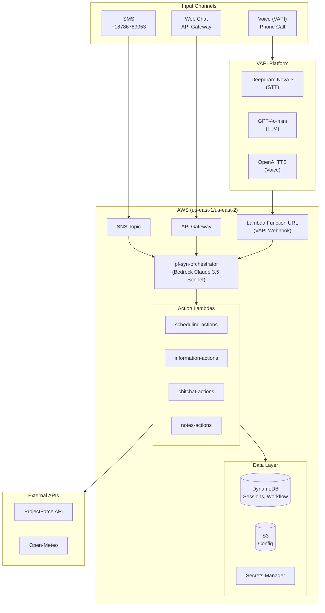
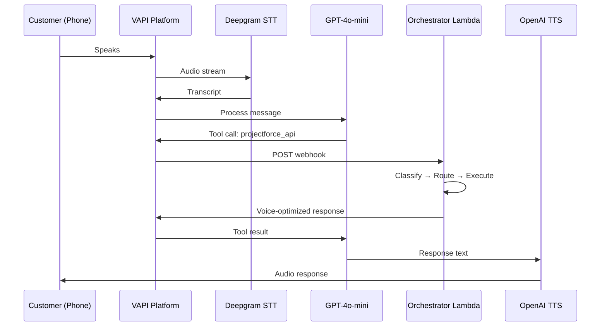
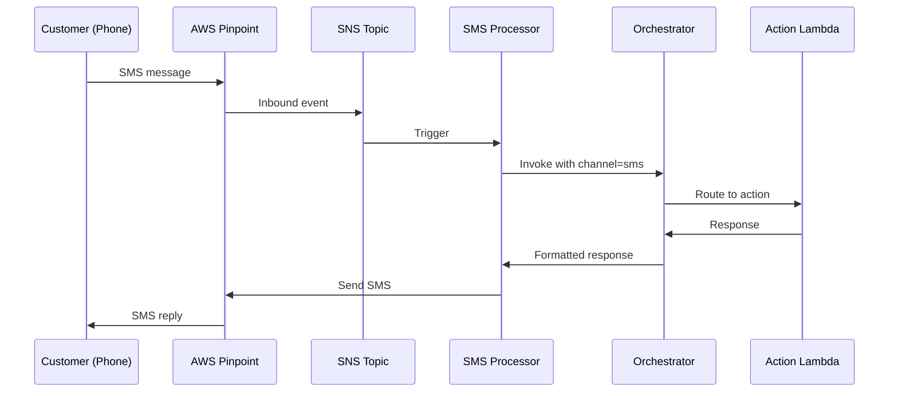
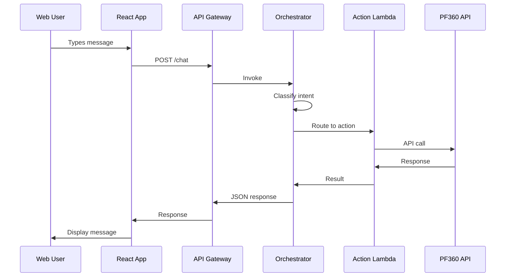

# AWS Resources Inventory - pf-syn-* Stack

> Complete inventory of AWS resources for the `pf-syn-*` AI Scheduling Agent stack.
> **Updated:** December 2025

---

## AWS Account Details

| Item | DEV | PROD |
|------|-----|------|
| **Account ID** | `772634497954` | `772634497954` |
| **Region** | `us-east-1` | `us-east-2` |
| **Resource Prefix** | `pf-syn-*-dev` | `pf-syn-*-prod` |

---

## 1. Lambda Functions

### 1.1 DEV Environment (us-east-1)

| Function Name | Runtime | Timeout | Memory | Purpose |
|---------------|---------|---------|--------|---------|
| `pf-syn-orchestrator-dev` | Python 3.11 | 120s | 512 MB | Main orchestration, classification, routing |
| `pf-syn-scheduling-actions-dev` | Python 3.11 | 60s | 1769 MB | Scheduling operations (list, schedule, reschedule, cancel) |
| `pf-syn-information-actions-dev` | Python 3.11 | 60s | 1769 MB | Project details, status queries |
| `pf-syn-chitchat-actions-dev` | Python 3.11 | 60s | 1769 MB | Greetings, help, general responses |
| `pf-syn-notes-actions-dev` | Python 3.11 | 60s | 512 MB | Note management |
| `pf-syn-sms-inbound-processor-dev` | Python 3.11 | 60s | 512 MB | SMS message processing |

### 1.2 PROD Environment (us-east-2)

| Function Name | Runtime | Timeout | Memory | Purpose |
|---------------|---------|---------|--------|---------|
| `pf-syn-orchestrator-prod` | Python 3.11 | 120s | 512 MB | Main orchestration, classification, routing |
| `pf-syn-scheduling-actions-prod` | Python 3.11 | 60s | 1769 MB | Scheduling operations |
| `pf-syn-information-actions-prod` | Python 3.11 | 60s | 1769 MB | Project details, status queries |
| `pf-syn-chitchat-actions-prod` | Python 3.11 | 60s | 1769 MB | Greetings, help, general responses |
| `pf-syn-notes-actions-prod` | Python 3.11 | 60s | 512 MB | Note management |
| `pf-syn-sms-inbound-processor-prod` | Python 3.11 | 60s | 512 MB | SMS message processing |

### 1.3 Lambda Function URLs (VAPI Webhooks)

| Environment | Function | URL Pattern |
|-------------|----------|-------------|
| DEV | `pf-syn-orchestrator-dev` | `https://{id}.lambda-url.us-east-1.on.aws/` |
| PROD | `pf-syn-orchestrator-prod` | `https://{id}.lambda-url.us-east-2.on.aws/` |

> **Note:** Lambda Function URLs are used as VAPI webhook endpoints for voice channel.

### 1.4 Orchestrator Environment Variables

```bash
# Common across environments
ORCHESTRATOR_MODEL=us.anthropic.claude-3-5-sonnet-20241022-v2:0
ALLOW_DIRECT_LAMBDA=true
USE_SUPERVISOR=false
ENABLE_MULTI_AGENT_ORCHESTRATION=false

# DEV-specific
ENVIRONMENT=dev
REGION=us-east-1
SCHEDULING_LAMBDA=pf-syn-scheduling-actions-dev
INFORMATION_LAMBDA=pf-syn-information-actions-dev
CHITCHAT_LAMBDA=pf-syn-chitchat-actions-dev
NOTES_LAMBDA=pf-syn-notes-actions-dev
DYNAMODB_TABLE=pf-syn-sessions-dev
WORKFLOW_STATE_TABLE=pf-workflow-states-dev
CONFIG_BUCKET=pf-syn-config-dev

# PROD-specific
ENVIRONMENT=prod
REGION=us-east-2
SCHEDULING_LAMBDA=pf-syn-scheduling-actions-prod
INFORMATION_LAMBDA=pf-syn-information-actions-prod
CHITCHAT_LAMBDA=pf-syn-chitchat-actions-prod
NOTES_LAMBDA=pf-syn-notes-actions-prod
DYNAMODB_TABLE=pf-syn-sessions-prod
WORKFLOW_STATE_TABLE=pf-workflow-states-prod
CONFIG_BUCKET=pf-syn-config-prod
```

### 1.5 Scheduling Actions Environment Variables

```bash
ENVIRONMENT=dev|prod
USE_MOCK_API=false
DEFAULT_CLIENT_ID=09PF05VD
DYNAMODB_TABLE=pf-syn-sessions-{env}
SECRET_NAME=projectforce/api/credentials
REGION=us-east-1|us-east-2
```

### 1.6 SMS Processor Environment Variables

```bash
ORCHESTRATOR_LAMBDA=pf-syn-orchestrator-{env}
SESSIONS_TABLE=pf-syn-sms-sessions-{env}
SMS_SESSIONS_TABLE=pf-syn-sms-sessions-{env}
MESSAGES_TABLE=pf-syn-sms-messages-{env}
CONSENT_TABLE=pf-syn-sms-consent-{env}
ORIGINATION_NUMBER=+18786789053
PF_SECRET_NAME=projectforce/api/credentials
ENVIRONMENT=dev|prod
REGION=us-east-1|us-east-2
```

---

## 2. VAPI Platform (Voice)

> **Note:** Voice channel uses VAPI platform instead of AWS Connect. VAPI handles STT (Deepgram), LLM (GPT-4o-mini), and TTS (OpenAI).

### 2.1 VAPI Assistants

| Environment | Assistant ID | Webhook URL |
|-------------|--------------|-------------|
| DEV | `2b437308-b93e-4da6-a2f1-ffbf422d5298` | Lambda Function URL (us-east-1) |
| PROD | `fa7fd950-dd7b-4900-9e92-4d8bc2c7342f` | Lambda Function URL (us-east-2) |

### 2.2 VAPI Configuration

| Setting | Value |
|---------|-------|
| **Model Provider** | OpenAI |
| **Model** | `gpt-4o-mini` |
| **Temperature** | 0.3 |
| **Voice Provider** | OpenAI |
| **Voice** | Alloy |
| **Transcriber** | Deepgram Nova-3 |
| **Endpointing** | 150ms |
| **serverMessages** | `["tool-calls"]` |

### 2.3 VAPI Tool Definition

```json
{
  "type": "function",
  "function": {
    "name": "projectforce_api",
    "description": "Call for ALL project-related requests",
    "parameters": {
      "type": "object",
      "required": ["message", "action"],
      "properties": {
        "action": {
          "type": "string",
          "enum": ["list_projects", "get_project_details", "get_available_dates",
                   "get_time_slots", "schedule", "reschedule", "cancel", "weather", "other"]
        },
        "message": {
          "type": "string",
          "description": "User's exact words"
        }
      }
    }
  }
}
```

### 2.4 VAPI API Keys (Secrets Manager)

| Environment | Secret Name |
|-------------|-------------|
| DEV | `vapi/api-key/dev` |
| PROD | `vapi/api-key/prod` |

---

## 3. DynamoDB Tables

### 3.1 Core Tables

| Table Name | Purpose | Key Schema |
|------------|---------|------------|
| `pf-syn-sessions-{env}` | User session state, conversation history | PK: `session_id` |
| `pf-workflow-states-{env}` | Multi-turn workflow state machine | PK: `session_id` |
| `pf-syn-customers-{env}` | Phone number → customer credentials lookup | PK: `phone_number` |

### 3.2 SMS Tables

| Table Name | Purpose | Key Schema |
|------------|---------|------------|
| `pf-syn-sms-sessions-{env}` | SMS session tracking | PK: `phone_number` |
| `pf-syn-sms-messages-{env}` | SMS message history | PK: `message_id` |
| `pf-syn-sms-consent-{env}` | SMS consent tracking | PK: `phone_number` |

### 3.3 Notes Tables

| Table Name | Purpose | Key Schema |
|------------|---------|------------|
| `pf-syn-notes-{env}` | Conversation notes | PK: `note_id` |
| `pf-syn-project-notes-{env}` | Project-specific notes | PK: `project_id`, SK: `note_id` |

### 3.4 Session State Schema

```json
{
  "session_id": "session-abc123",
  "customer_id": "cust-456",
  "channel": "voice|chat|sms",
  "caller_phone": "+15551234567",
  "pf_credentials": {
    "baseUrl": "https://api.projectsforce.com",
    "authToken": "Bearer xxx"
  },
  "conversation_history": [...],
  "last_action": "list_projects",
  "timestamp": 1735200000,
  "ttl": 1735203600
}
```

### 3.5 Workflow State Schema

```json
{
  "session_id": "session-abc123",
  "workflow_type": "schedule_appointment",
  "current_stage": "awaiting_time_selection",
  "context": {
    "project_id": "7751748",
    "project_name": "Storm Door",
    "category": "Storm Door",
    "project_type": "Call Back",
    "date": "2025-12-27",
    "available_dates": ["2025-12-27", "2025-12-28"],
    "available_times": ["09:00 AM", "10:00 AM"]
  },
  "project_mapping": {...},
  "pending_action": {...},
  "timestamp": 1735200000,
  "ttl": 1735203600
}
```

---

## 4. S3 Buckets

| Bucket Name | Purpose | Region |
|-------------|---------|--------|
| `pf-syn-config-dev` | Configuration files (statuses.json, categories.json) | us-east-1 |
| `pf-syn-config-prod` | Configuration files | us-east-2 |

### 4.1 Configuration Files

| Path | Purpose |
|------|---------|
| `orchestrator/{env}/statuses.json` | Project status classifications |
| `orchestrator/{env}/categories.json` | Category bucket mappings |

### 4.2 statuses.json Schema

```json
{
  "version": "1.0",
  "schedulable_statuses": ["New", "Ready To Schedule", "Reschedule Requested"],
  "scheduled_statuses": ["Scheduled", "Confirmed", "In Progress"],
  "completed_statuses": ["Completed", "Closed"],
  "cancelled_statuses": ["Cancelled", "Customer Cancelled"]
}
```

---

## 5. Secrets Manager

| Secret Name | Purpose | Used By |
|-------------|---------|---------|
| `projectforce/api/credentials` | PF360 API credentials (phone-based lookup) | All action Lambdas |
| `vapi/api-key/dev` | VAPI API key (DEV) | VAPI management scripts |
| `vapi/api-key/prod` | VAPI API key (PROD) | VAPI management scripts |

### 5.1 PF Credentials Schema

```json
{
  "+15551234567": {
    "baseUrl": "https://api.projectsforce.com",
    "clientId": "09PF05VD",
    "userId": "1646085",
    "authToken": "Bearer xxx"
  }
}
```

---

## 6. IAM Roles

### 6.1 Lambda Execution Roles

| Role Name | Purpose |
|-----------|---------|
| `pf-syn-orchestrator-role-{env}` | Orchestrator Lambda execution |
| `pf-syn-scheduling-actions-role-{env}` | Scheduling Lambda execution |
| `pf-syn-information-actions-role-{env}` | Information Lambda execution |
| `pf-syn-chitchat-actions-role-{env}` | Chitchat Lambda execution |
| `pf-syn-notes-actions-role-{env}` | Notes Lambda execution |
| `pf-syn-sms-inbound-role-{env}` | SMS processor Lambda execution |

### 6.2 Required IAM Permissions

```json
{
  "Bedrock": [
    "bedrock:InvokeModel",
    "bedrock:InvokeModelWithResponseStream"
  ],
  "Lambda": [
    "lambda:InvokeFunction"
  ],
  "DynamoDB": [
    "dynamodb:GetItem",
    "dynamodb:PutItem",
    "dynamodb:UpdateItem",
    "dynamodb:Query",
    "dynamodb:Scan",
    "dynamodb:DeleteItem"
  ],
  "S3": [
    "s3:GetObject",
    "s3:ListBucket"
  ],
  "SecretsManager": [
    "secretsmanager:GetSecretValue"
  ],
  "CloudWatchLogs": [
    "logs:CreateLogGroup",
    "logs:CreateLogStream",
    "logs:PutLogEvents"
  ],
  "SNS": [
    "sns:Publish"
  ],
  "SMSVoice": [
    "sms-voice:SendTextMessage"
  ]
}
```

---

## 7. API Gateway

| API Name | API ID | Stage | Endpoint |
|----------|--------|-------|----------|
| `pf-syn-orchestrator-api-dev` | `4e4680oc2h` | `dev` | `https://4e4680oc2h.execute-api.us-east-1.amazonaws.com/dev` |

### 7.1 Endpoints

| Method | Path | Lambda |
|--------|------|--------|
| POST | `/chat` | `pf-syn-orchestrator-{env}` |

---

## 8. SMS (AWS End User Messaging)

| Item | Value |
|------|-------|
| **SMS Phone Number** | `+18786789053` |
| **Phone ARN** | `arn:aws:sms-voice:us-east-1:772634497954:phone-number/phone-a35b5011d15b4d938b008ca1102e9658` |
| **Two-Way Enabled** | `true` |
| **Two-Way Channel** | SNS Topic (see below) |

---

## 9. SNS Topics

| Topic ARN | Purpose |
|-----------|---------|
| `arn:aws:sns:us-east-1:772634497954:pf-syn-sms-inbound-dev` | SMS inbound trigger |

---

## 10. Amazon Bedrock

### 10.1 Model Access Required

| Model ID | Model Name | Usage |
|----------|------------|-------|
| `us.anthropic.claude-3-5-sonnet-20241022-v2:0` | Claude 3.5 Sonnet v2 | Intent classification, response generation |

> **Note:** Enable model access in AWS Bedrock console for both us-east-1 and us-east-2.

---

## 11. CloudWatch

### 11.1 Log Groups

| Log Group | Lambda |
|-----------|--------|
| `/aws/lambda/pf-syn-orchestrator-{env}` | Orchestrator |
| `/aws/lambda/pf-syn-scheduling-actions-{env}` | Scheduling |
| `/aws/lambda/pf-syn-information-actions-{env}` | Information |
| `/aws/lambda/pf-syn-chitchat-actions-{env}` | Chitchat |
| `/aws/lambda/pf-syn-notes-actions-{env}` | Notes |
| `/aws/lambda/pf-syn-sms-inbound-processor-{env}` | SMS |

### 11.2 Key Metrics

| Metric | Namespace | Description |
|--------|-----------|-------------|
| Invocations | AWS/Lambda | Function invocation count |
| Duration | AWS/Lambda | Execution time |
| Errors | AWS/Lambda | Error count |
| ConcurrentExecutions | AWS/Lambda | Concurrent runs |

---

## 12. Architecture Diagrams

### 12.1 High-Level Architecture



### 12.2 Voice Flow (VAPI)



### 12.3 SMS Flow



### 12.4 Chat Flow



---

## 13. Deployment Commands

### 13.1 Package and Deploy Orchestrator

```bash
# Package
cd lambda/orchestrator
zip -r /tmp/orchestrator.zip *.py -x "test_*.py"

# Deploy to DEV
aws --profile pf-aws lambda update-function-code \
  --function-name pf-syn-orchestrator-dev \
  --zip-file fileb:///tmp/orchestrator.zip \
  --region us-east-1

# Deploy to PROD
aws --profile pf-aws lambda update-function-code \
  --function-name pf-syn-orchestrator-prod \
  --zip-file fileb:///tmp/orchestrator.zip \
  --region us-east-2
```

### 13.2 View Logs

```bash
# DEV Orchestrator
aws --profile pf-aws logs tail /aws/lambda/pf-syn-orchestrator-dev \
  --region us-east-1 --since 5m --format short

# PROD Orchestrator
aws --profile pf-aws logs tail /aws/lambda/pf-syn-orchestrator-prod \
  --region us-east-2 --since 5m --format short

# DEV SMS
aws --profile pf-aws logs tail /aws/lambda/pf-syn-sms-inbound-processor-dev \
  --region us-east-1 --since 5m --format short
```

### 13.3 Test Chat API

```bash
curl -X POST https://4e4680oc2h.execute-api.us-east-1.amazonaws.com/dev/chat \
  -H "Content-Type: application/json" \
  -d '{
    "message": "hello",
    "session_id": "test-123",
    "pf_client_id": "09PF05VD",
    "pf_user_id": "1646085",
    "channel": "chat"
  }'
```

### 13.4 Update VAPI Assistant

```bash
# Get current config
curl "https://api.vapi.ai/assistant/{ASSISTANT_ID}" \
  -H "Authorization: Bearer {VAPI_KEY}"

# Update config
curl -X PATCH "https://api.vapi.ai/assistant/{ASSISTANT_ID}" \
  -H "Authorization: Bearer {VAPI_KEY}" \
  -H "Content-Type: application/json" \
  -d '{
    "model": {"temperature": 0.3},
    "serverUrl": "https://xxx.lambda-url.us-east-1.on.aws/"
  }'
```

### 13.5 Check Secrets

```bash
aws --profile pf-aws secretsmanager get-secret-value \
  --secret-id projectforce/api/credentials \
  --query SecretString --output text | jq .
```

---

## 14. Setup Order (New Environment)

1. **Create IAM Roles** with required policies
2. **Create DynamoDB Tables** (sessions, workflow-states, customers, sms-*)
3. **Create S3 Bucket** for configuration (pf-syn-config-{env})
4. **Upload Config Files** (statuses.json, categories.json)
5. **Create Secrets** in Secrets Manager (API credentials)
6. **Enable Bedrock Model Access** for Claude 3.5 Sonnet
7. **Deploy Lambda Functions** with Function URLs enabled
8. **Create API Gateway** and link to orchestrator
9. **Create SNS Topic** for SMS inbound
10. **Configure SMS Phone Number** two-way messaging
11. **Create VAPI Assistant** with webhook pointing to Lambda Function URL

---

## 15. Legacy Resources (Deprecated)

> These resources were used in earlier implementations but are no longer active.

| Resource | Type | Status |
|----------|------|--------|
| `pf-syn-lex-fulfillment-dev` | Lambda | Deprecated (replaced by VAPI) |
| `pf-syn-voice-bedrock-bridge-dev` | Lambda | Deprecated |
| `pf-syn-customer-lookup-dev` | Lambda | Deprecated |
| `pf-syn-scheduling-assistant-dev` | Lex V2 Bot | Deprecated |
| `pf-schedule-voice-dev` | Connect Instance | Deprecated |
| `+14702832382` | Connect Phone | Deprecated |

---

## 16. Quick Reference

### 16.1 Key Resources by Environment

| Resource | DEV | PROD |
|----------|-----|------|
| **Region** | us-east-1 | us-east-2 |
| **Orchestrator** | pf-syn-orchestrator-dev | pf-syn-orchestrator-prod |
| **Sessions Table** | pf-syn-sessions-dev | pf-syn-sessions-prod |
| **Workflow Table** | pf-workflow-states-dev | pf-workflow-states-prod |
| **Config Bucket** | pf-syn-config-dev | pf-syn-config-prod |
| **VAPI Assistant** | 2b437308-... | fa7fd950-... |

### 16.2 Phone Numbers

| Channel | Number | Purpose |
|---------|--------|---------|
| SMS | +18786789053 | Bidirectional SMS |
| Voice | Via VAPI | VAPI-managed phone numbers |

### 16.3 External Endpoints

| Service | Endpoint |
|---------|----------|
| ProjectForce API | `https://api.projectsforce.com` |
| Weather API | `https://api.open-meteo.com` |
| Geocoding API | `https://nominatim.openstreetmap.org` |
| VAPI API | `https://api.vapi.ai` |

---

*Last Updated: December 2025*
